ErrorHandler接口规范  
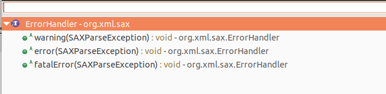  

DOM树中的对象类型  
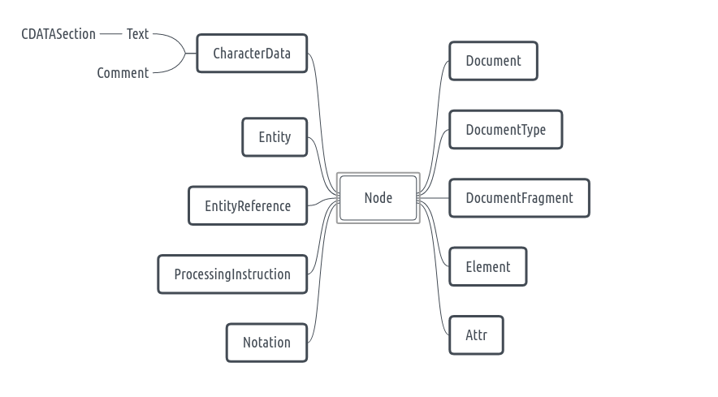

DOM的解析器  
- `javax.xml.parsers.DocumentBuilder`  
- `javax.xml.parsers.DocumentBuilderFactory`  

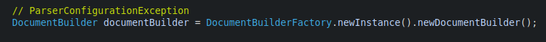  

DocumentBuilderFactory常用方法  
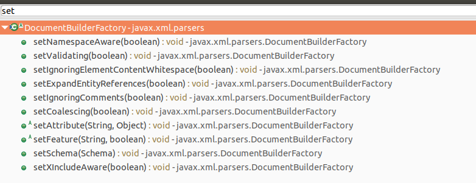  
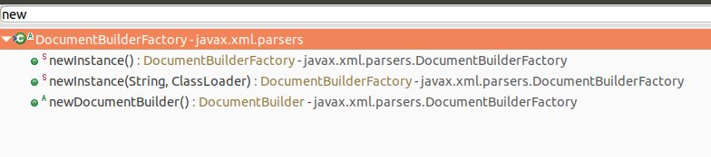  

DocumentBuilder常用方法  
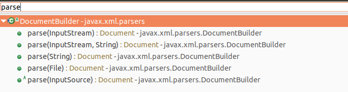  

Node常用方法  
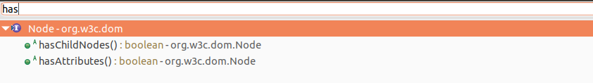  
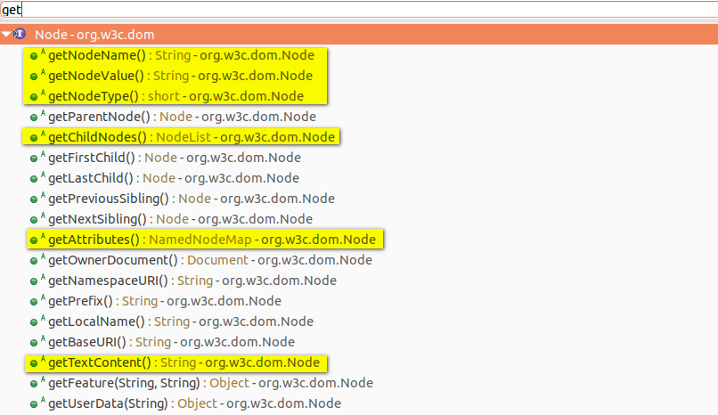  

Document常用方法  
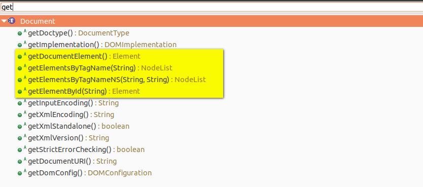  

Element常用方法  
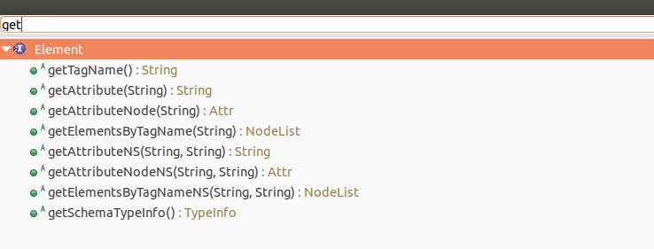  
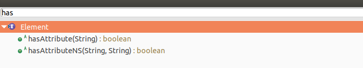  

NodeList常用方法  
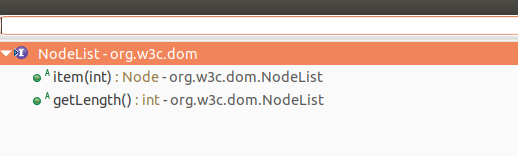  

NamedNodeMap常用方法  
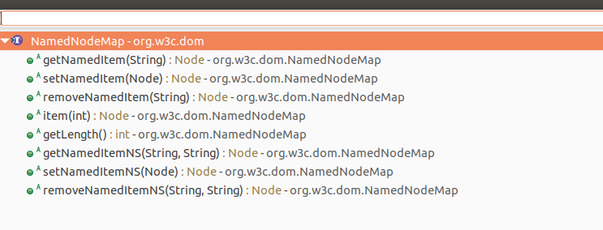  
