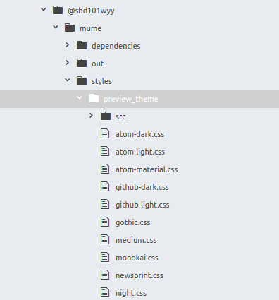
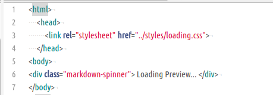
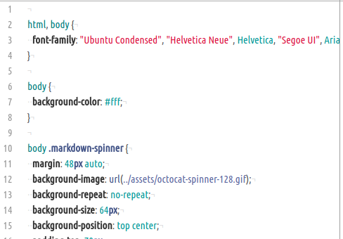
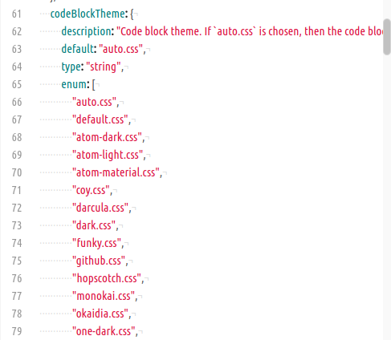
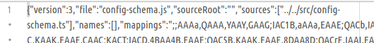
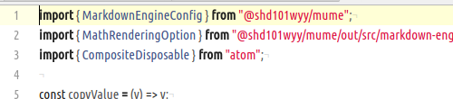
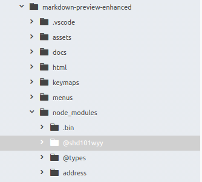

此处预览md的插件是`markdown-preview-enhanced`.  

> 修改步骤  

-  配置文件夹路径为:`.atom/packages/markdown-preview-enhanced/node_modules/@shd101wyy/mume/style/preview_theme/`  
    
- 选择使用的`css`样式文件,进行修改.  
- 重启atom即可.  

> 配置文件查找思路

- 查看插件目录结构,首先定位`html`和`styles`,查看其内文件.  
  `./html/loading.html`文件  
    
  `./styles/loading.css`文件  
    
  此为加载时显示页面,定位错误.  
- 查看`./out/src`文件.  
  `./out/src/config-schema.js`文件  
    
  配置选择的样式列表,估计此为配置选项页.  此文件无资源导入路径的配置,查看对应的`map`文件.  
  `./out/src/config-schema.js.map`文件  
    
  有文件路径,定位查看.  
  `./src/config.ts`文件  
    
  首行便有资源导入标记.  
- 故定位到这个`@shd101wyy`目录,缩小查找范围,最后找到对应的`css`文件.  
    
