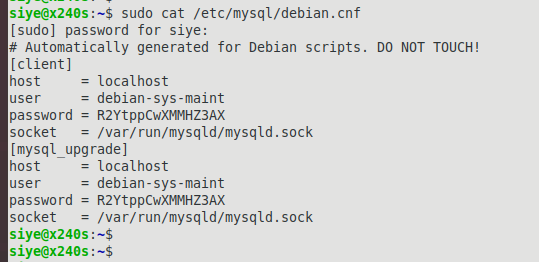
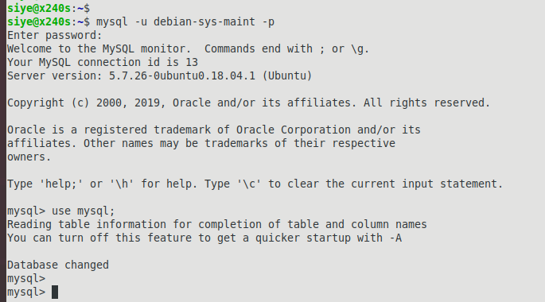
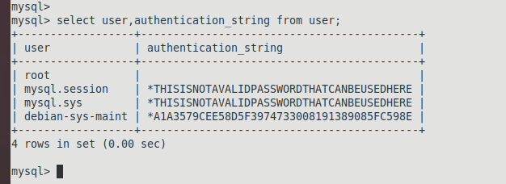
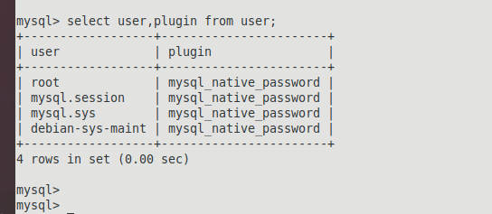

#### 场景提要  
- 报错信息  
  `ERROR 1698 (28000): Access denied for user 'root'@'localhost'`  
- 配置环境  
  (1)ubuntu18.0.4系统;  
  (2)MYSQL安装方式,使用`apt-get`的方式,  
  `sudo apt-get install mysql-server`  
  `sudo apt-get install mysql-client`  
- 问题描述  
  使用apt安装mysql后,执行`mysql -u root -p`无法进入.  

#### 解决方案  
- 参考文档  
  `https://www.jianshu.com/p/bb60088c61bb`  
  `http://blog.sina.com.cn/s/blog_7c987bee0102yz76.html`  
- 总结解决方案  
  (1)查看系统默认的用户及密码.  
    
  (2)使用`debian-sys-maint`用户登录mysql;  
    
  (3)使用`mysql`数据库,更改`user`表,更改`authentication_string`字段.对应root用户.  
    
  (4)执行`flush privileges`  
  (5)同样是上表,参考更改`plugin`字段,对应root用户.  
    
  (6)执行`flush privileges`  
  (7)至此,可使用`mysql -u root -p`登录,密码为空.  
