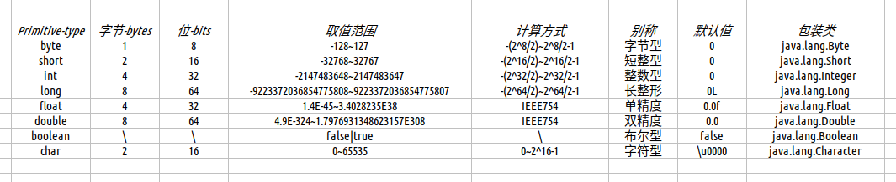
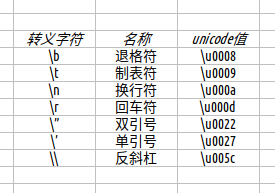
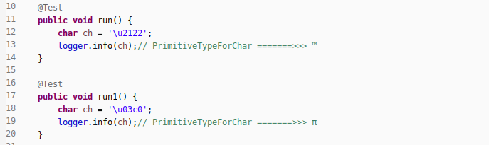
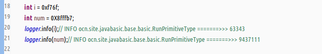
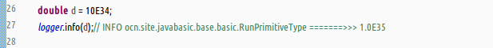
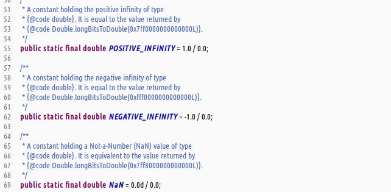
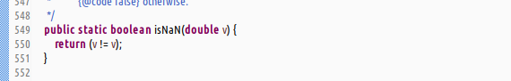
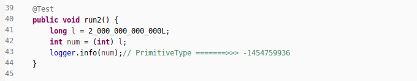

#### 基本类型概览  
1. 8种基本类型  
     
1. 数据类型中的分类  
   - 基本数据类型,分为整数类型,浮点类型,字符类型,布尔类型;  
   - 引用数据类型,即Java中对象实例的引用.  
1. 编程语言简要分类  
   - 强类型语言,声明变量明确类型,标识符引用不能任意更改类型;  
   - 弱类型语言,声明变量不明确类型,标识符引用可任意更改类型;  

#### 单讲char类型  
1. Java中字符类型支持的转义字符  
     
1. 简说`char`类型  
   - `char`类型可以用单引号进行表示,直接表示单个字符.  
   - 也可以用十六进制的方式表示,但是同时也要使用单引号进行标记.  
   - 十六进制表示的方式范围是`\u0000~\uffff`.  
   - `demo`  
       
   - _慎重在注释中使用`\u`_  
1. Unicode和char之间涉及的专业术语和概念  
   - `码点`,`代码单元`,`替代区域`  
   - `17个代码级别`,`第1个代码级别(基本的多语言级别)`,`其余16个代码级别(包含辅助字符)`  
   - Java采用16位的Unicode字符集.  
   - Java中,char类型描述了UTF-16中的第1个代码单元.  

#### 特殊值的处理  
1. 个别基本类型需要后缀处理  
   - __机制原因__  
     a : Java对基本类型有自动类型转换机制;  
     b : 在8种基本类型中,整数类型的默认类型是`int`,浮点类型的默认类型是`double`;  
   - __float类型后缀f或F,long类型后缀l或L__  
       
1. 数值的特殊表示赋值方法  
   - __二进制表示法__  
     jdk1\.7新增,前缀`0b`表示二进制.  
       
   - __八进制表示法__  
     数值前缀阿拉伯数字`0`.  
       
   - __十六进制表示法__  
     数值前缀符号`0x`或之`0X`.  
       
   - __长整数表示法__  
     jdk1\.7新增,编译器支持在数字之间使用符号`_`连接.  
       
   - __科学计算法__  
     a : 编译器支持使用符号`E`表示科学计数法,因为符号`^`被异或运算符占用了.  
     b : 只能用来表示浮点类型的数值!  
       
   - __十六进制指数表示法__  
     a : jdk1\.5编译器支持使用符号`p`表示2的指数幂.  
     b : 只能用来表示浮点类型的数值.  
       
1. IEEE754标准的三个特殊值  
   - __正负无穷大和NaN__  
     参考java\.lang\.Double中内置属性  
       
   - __如何正确的判断这三种特殊值__  
     a : 错误的方式,是使用符号`==`进行判断,但是得到的结果永远是false.  
     _因为在Java中,所有的'非数值'都被判断为不想等的._  
     b : 正确的方式是使用java\.lang\.Double中的方法进行判断.  
       
       

#### 类型之间的转换  
1. 类型转换分类  
   - 隐式类型转换;  
   - 强制类型转换;  
1. 隐式类型转换  
   - _小类型向大类型自动进行隐式类型转换._  
   - byte,short,char类型和int类型运算,会自动转换为int类型再运算.  
   - byte,short,char,int类型和long类型运算,会自动转换long类型再运算.  
   - byte,short,char,int,long类型和float类型运算,会自动转换为float类型再运算.  
   - byte,short,char,int,long,float类型和double类型运算,会自动转换为double类型再运算.  
1. 强制类型转换  
   - 使用符号`()`进行强制类型转换.  
   - 格式语法为`newType newIdentifier = (newType)oldIndentifier;`  
   - 强制类型转换失败会抛出`java.lang.ClassCastException`异常.  ,
   - 对于数值类型的强制类型转换,可能会出现精度丢失的情况.  
   - `demo`  
       
