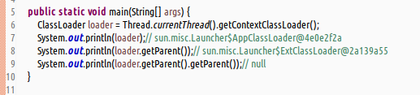

- __类加载器有何作用?__  
  (1)java语言允许通过程序化的方式,间接的对`Class`进行操作.  
  (2)类加载器负责加载class文件,然后在jvm中生成一份描述class结构的元信息对象.  
  (3)jvm通过这份元信息对象,可以获知class的结构信息,如构造函数,属性和方法等等.  
  (4)java允许使用这个与class有关的元信息对象,来调用对象的功能.  
- __在java内置库中涉及的有哪几个主要的类?__  
  `java.lang.ClassLoader`  
  `java.lang.Class<T>`  
  `java.lang.reflect.Constructor<T>`  
  `java.lang.reflect.Field`  
  `java.lang.reflect.Method`  
  等等  
- __类加载器的工作机制__  
  说白了,类加载器就是负责寻找和装载字节码文件,并在jvm中构造出表示元信息对象的组件.  
  以下详细说明类加载器的机制步骤;  
  (1)装载:查找和导入class文件;  
  (2)链接:执行校验,准备,解析工作.(其中解析工作是可选的)  
  &#8195;a.校验:检查加载的class文件的数据的正确性.  
  &#8195;b.准备:给类的静态变量分配存储空间.  
  &#8195;c.将符号引用转换为直接引用.  
  (3)初始化:对类的静态变量和静态代码块执行初始化工作.  
- __java中类加载器的架构如何?__  
  类的加载工作是由`ClassLoader`及其子类负责的,涉及的类有3个,即`ClassLoader`(根加载器),`ExtClassLoader`(扩展类加载器),`AppClassLoader`(应用类加载器).  
  以下对这三个类做个简要的解释;  
  (1)根加载器,ClassLoader.  
  &#8195;a.其是java运行期的一个重要的系统组件,主要负责查找和加载字节码文件.  
  &#8195;b.jvm在运行期会产生其及其两个子类.  
  &#8195;c.其是使用C++语言编写的,因此在Java中是看不到它的.在执行以下代码会返回null.  
  &#8195;`Thread.currentThread().getContextClassLoader().getParent().getParent()`  
  &#8195;d.主要负责加载JRE中的核心类库,如jre目录下的`rt.jar`,`charsets.jar`等.  
  (2)扩展类加载器,ExtClassLoader.  
  &#8195;a.是ClassLoader的子类.  
  &#8195;b.主要负责加载jre目录下ext目录中的jar包.  
  (3)应用类加载器,AppClassLoader.  
  &#8195;a.是ExtClassLoader的子类.  
  &#8195;b.主要负责加载classpath路径下的类包.  
  (4)参考简单的测试代码  
    
- __什么是全盘负责委托机制?__  
  (1)_全盘负责_ : 指的是,当一个ClassLoader加载一个类时,除非显式的使用另一个ClassLoader,否则该类所有的依赖及其引用的类,都由这个ClassLoader来加载.  
  (2)_委托机制_ : 指的是,在加载任何类的时候,当前的类加载器会委托自己的父类加载器来查找加载这个类,若是找不到这个类,才会从自己的类路径下查询加载该类.  
  (3)_全盘负责委托机制的好处_ : 安全角度来讲,若是有个恶意的基础类被类加载器加载到jvm中,会引起严重的安全隐患.但是有了全盘负责委托机制,比如`java.lang.String`类,它永远是由ClassLoader负责加载的,这样在很大程度上就避免了这种安全隐患.  
  (4)_全盘负责委托机制引发的问题_ : 在实际开发中,基本上都会遇到过一种异常,该异常在大多情况下,基本上都是由于全盘负责委托机制引发的.该异常是:`java.lang.NoSuchMethodError`.  
  &#8195;a.引发的原因,jar包多版本冲突导致;比如两个不同版本的jar包,被引用到类路径下.假设类A中的某个方法,在版本X中没有,但是在版本Y中却是新增了.但但恰巧类加载器却是从版本X的jar包中加载类A,这就会触发NoSuchMethodError的异常.  
  &#8195;b.解决的方法,先确定这个原因是否由全盘负责委托机制引起的.若是然后再排查确认类A是由版本X中加载的,还是从版本Y中加载的.另外可编写一个查询类,查询一个类是从哪个jar包中加载的,此方法的编写可参考本书的分享工具类,也可直接拿来使用.  
