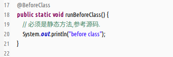
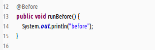
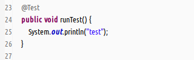
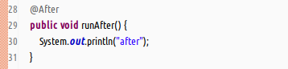
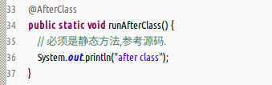
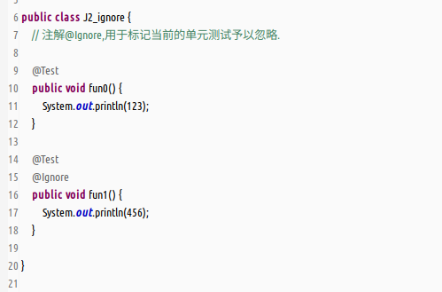
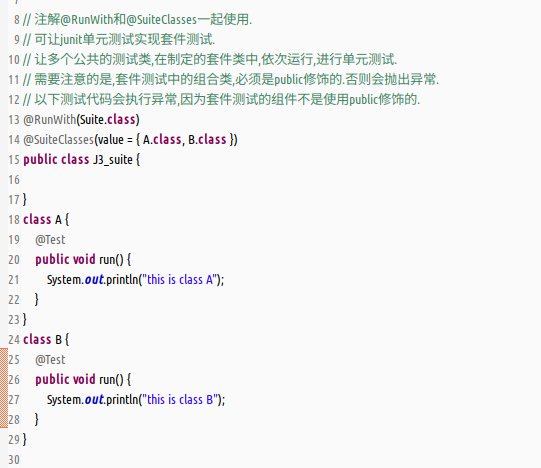
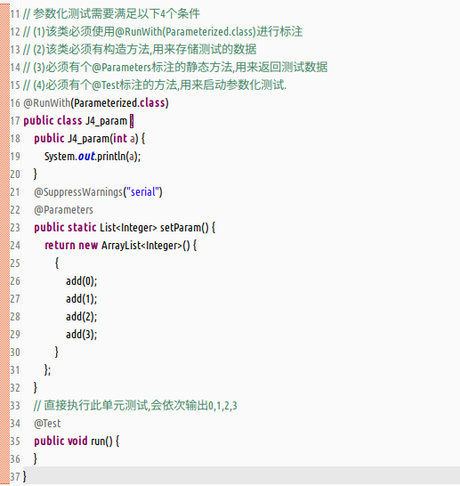
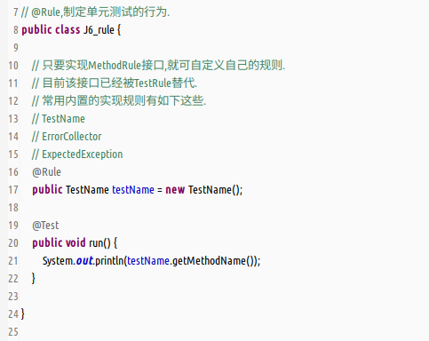

- junit4的基础注解  
  (1)`@BeforeClass`,类加载时执行一次.  
    
  (2)`@Before`,单元测试方法执行前执行.  
    
  (3)`@Test`,标记单元测试方法.  
    
  (4)`@After`,单元测试方法执行后执行.  
    
  (5)`@AfterClass`,类销毁时执行.  
    
- 内置断言工具类的使用,功能丰富.  
    
- 忽略测试,用于标记需要忽略执行的单元测试方法.  
    
- 组件测试,可同时执行多个测试类,但这些类必须标记为public.  
    
- 参数化测试,用于批量注入不同参数,执行单元测试.  
    
- 规则测试,丰富单元测试内容,可自定义扩展,也可使用内置的几种规则.  
    
