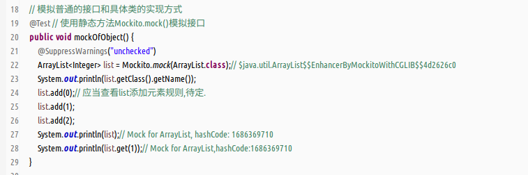
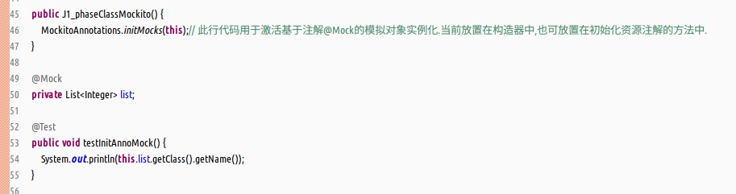
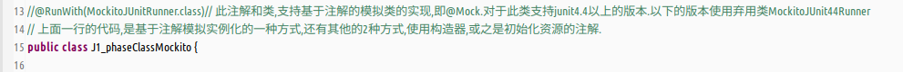
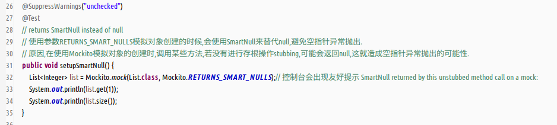
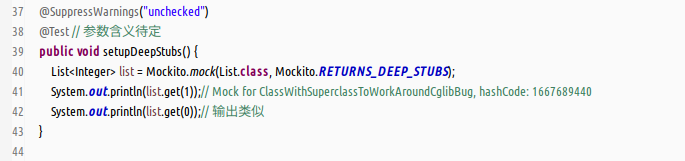
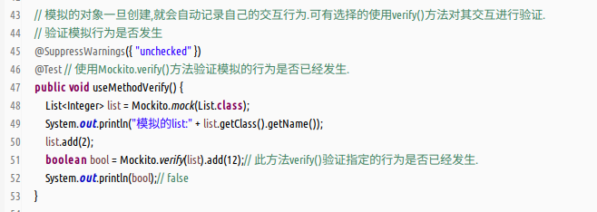
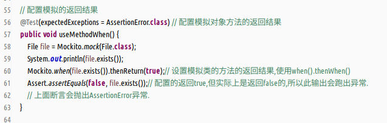
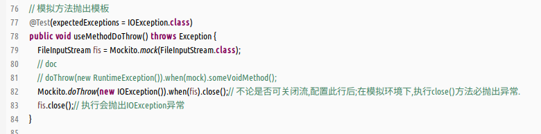
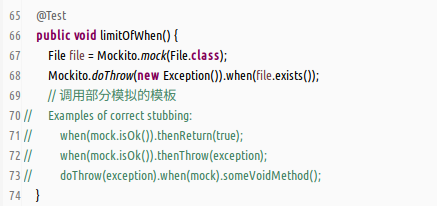

#### 提要  
- 支持模拟的测试框架有哪些?  
  EasyMock,JMock,Mockito,MockCreator,Mokcrunner,MockMaker等等.  
- 什么是Mockito?  
  (1)Mockito是一个针对Java的模拟单元测试框架.  
  (2)和EasyMock,JMock很相似.  
  (3)通过执行后检查是否已经被调用,消除了对期望行为的需要.  
  (4)学习成本低廉,API非常简介,测试代码可读性很高.  
- Mockito可以模拟什么?  
  (1)可以模拟接口和具体类的实现,同时可省略标识符,但一般不推荐.  
  (2)无法模拟final类,匿名内部类,java基本类型.  
  (3)可通过静态方法`org.mockito.Mockito.mock(Class<T>)`模拟,也可通过注解`@Mock`模拟对象实例.选择多样.  
- 添加mvn依赖:`/org.mockito/mockito-al/1.9.5`,测试时使用版本.  
- 使用mockito要基于junit或之testng,应当添加对应的资源包.  

#### 演示  
- 基本的使用,如何初始化需要模拟的对象.  
  (1)使用Mockito中的静态方法,直接在单元测试方法中创建.  
    
  (2)使用注解`@Mock`创建,基于构造器或之初始化资源注解.  
    
  (3)基于注解`@Mock`,`@RunWith`,`MockitoJunitRunner.class`的方式.  
    
  (4)创建模拟对象的3点限制  
  &#8195;a.不能够模拟final修饰的对象;  
  &#8195;b.不能够模拟匿名内部类;  
  &#8195;c.不能够模拟java的基本类型;  
- 模拟对象是的可选择配置,目前学习的有2种方案可选.  
  (1)使用SmartNull配置  
    
  (2)使用DeepStubs配置  
    
- 验证模拟的交互行为,使用verify方法.  
    
- 期望模拟返回值验证,使用when方法.  
  (1)when方法有哪些限制?  
  不能调用模拟对象中,使用static或之final修饰的方法.  
  (2)简单的演示  
    
- 期望异常抛出验证,使用doThrow方法.  
    
- 关于期望方法中的模板代码  
  (1)模板代码  
  ```java
  when(mock.isOk()).thenReturn(true);
  when(mock.isOk()).thenThrow(exception);
  doThrow(exception).when(mock).someVoidMethod();
  ```  
  (2)调用输出该异常日志的案例  
    
- 备注,仅仅简单的学习mockito的使用,深入可查看源码和doc.  
