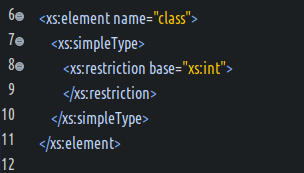
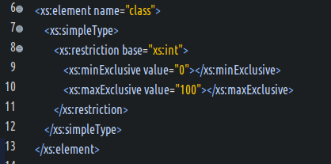
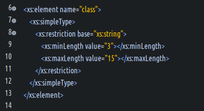
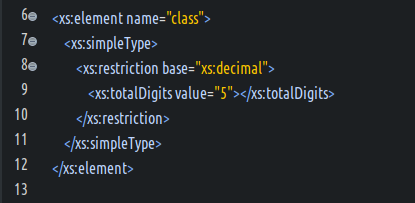
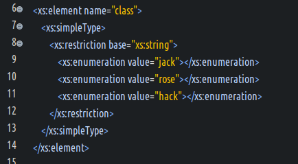
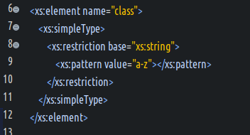
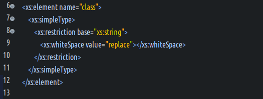

#### XSD内置类型概览  
- DTD属性类型的兼容方案  
  (1) 为了XML Schema和XML 1.0 DTD保持良好的兼容性.  
  (2) 有那些DTD的属性类型?全部.  
  `CDATA`,`ID`,`IDREF`,`IDREFS`,`NMTOKEN`,`NMTOKENS`,`ENTITY`,`ENTITIES`,`NOTATION`等等.  
  (3) 这些类型在XSD文档中的用途?  
  这些类型,在XSD中只能用来约束属性的类型!  
- 字符串及其派生类型  
  (1) `string` : 字符串数据,不会处理特殊符号,如空格,制表符,换行符,回车符等.  
  (2) `normalizedString` : 会将字符串内部的特殊符号替换为空格.  
  (3) `token` : 会将字符串内部以及前后的特殊符号替换为空格.  
  (4) `Name` : 只允许合法的XML标识符.  
  (5) `NCName` : 只允许不带命名空间前缀的合法的XML标识符.  
  (6) `QName` : 允许带命名空间前缀的合法的XML标识符,但是不能以符号开头.  
  (7) 派生的`CDATA`,`ID`,`IDREF`,`IDREFS`,`NMTOKEN`,`NMTOKENS`,`ENTITY`,`ENTITIES`,`NOTATION`等类型,不再赘述.  
- 数值类型  
  (1) `byte` : 有正负的8位整数  
  (2) `short` : 有正负的16位整数  
  (3) `int` : 有正负的32位整数  
  (4) `integer` : 整数值  
  (5) `long` : 有正负的64位整数  
  (6) `negativeInteger` : 仅包含负数的整数(...,-2,-1)  
  (7) `positiveInteger` : 仅包含正数的整数(1,2,3,...)  
  (8) `nonNegativeInteger` : 仅包含正数的整数(0,1,2,...)  
  (9) `nonPositiveInteger` : 仅包含非正数的整数(...,-2,-1,0)  
  (11) `unsignedByte` : 无正负的 8 位整数  
  (12) `unsignedShort` : 无正负的 16 位整数  
  (13) `unsignedInt` : 无正负的 32 位整数  
  (14) `unsignedLong` : 无正负的64位整数  
- 日期和时间类型  
  (1) `date` : 日期,格式是YYYY-MM-DD  
  (2) `time` : 时间,格式是hh:mm:ss.sss  
  (3) `datetime` : 日期时间,格式是YYYY-MM-DDThh:mm:ss.sss,其中T字母用于隔开日期和时间  
  (4) `gYear` : 表示年,格式是YYYY  
  (5) `gMonth` : 表示月,格式是MM  
  (6) `gDay` : 表示日,格式是DD  
  (7) `duration` : 表示被格式化的日期时间,格式是PnHnMnDTnHnMnS  
- 杂项  
  (1) `boolean` : 预置4个合法的值,true,false,1,0  
  (2) `anyURI` : 仅支持合法的URI地址  
  (3) `hexBinary` : 16进制的2进制数据,和常规的16进制表示法无区别  
  (4) `base64Binary` : 由a-z,A-Z,0-9和+号组成,长度必须是64的倍数,每个字符占用2个字节,详细参考base64规则  

#### 内置类型的约束方式  
- 什么是基类型?  
  基类型,就是XSD的内置类型.  
- 使用`<restriction .../>`标签进行约束.  
- 示例  
    

#### XSD内置的12种约束  
- 什么是XSD的约束?  
  Schema把各种约束称之为facet.通常使用`<restriction .../>`标签进行管理.  
- 内置的12种facet  
  范围约束  
  (1) `maxExclusive` : 约束元素或之属性的上界值  
  (2) `minExclusive` : 约束元素或之属性的下界值  
  (3) `maxInclusive` : 约束元素或之属性小于等于该值  
  (4) `minInclusive` : 约束元素或之属性大于等于该值  
  精度约束  
  (5) `totalDigits` : 约束decimal及其派生类型树枝的最大位数,包含整数位和小数位  
  (6) `fractionDigits` : 约束10进制精度数值小数点后的小数位数  
  长度约束  
  (7) `length` : 约束元素或之属性的字符长度  
  (8) `maxLength` : 约束字符串的最大长度  
  (9) `minLength` : 约束字符串的最小长度  
  枚举约束  
  (10) `enumeration` : 约束元素或之属性的值是枚举值  
  正则约束  
  (11) `pattern` : 约束其值必须匹配正则表达式  
  空白约束  
  (12) `whiteSpace` : 约束字符串空白的处理方式  

#### 内置12种facet约束简单测试  
- 基类型范围约束测试  
    
- 基类型长度约束测试  
    
- 基类型精度约束测试  
    
- 基类型枚举约束测试  
    
- 基类型正则约束测试  
    
- 基类型空白约束测试  
  (1) 关于空白约束3个候选值的说明  
  `preserve` : 保留值之间的所有空白;  
  `replace` : 值之间的所有空白,都替换为单个空格;  
  `collapse` : 先执行replace,然后去除前后的空白;  
  (2) 简单示例  
    
