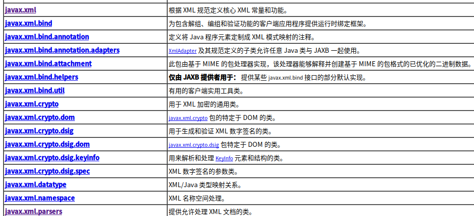
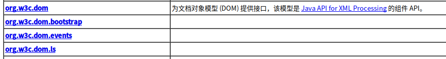
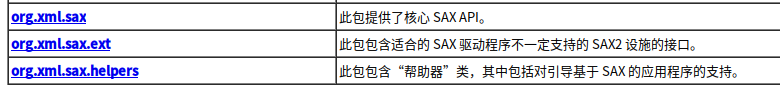
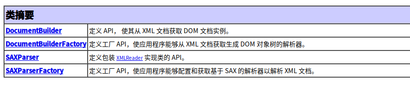
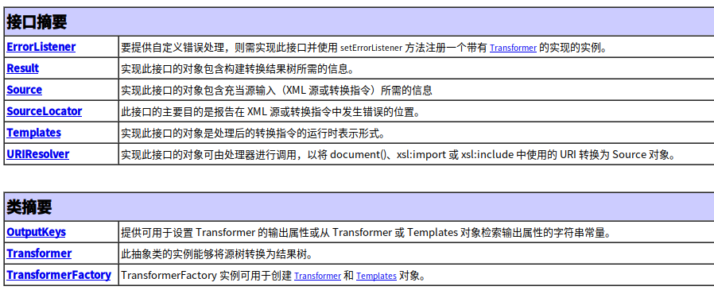
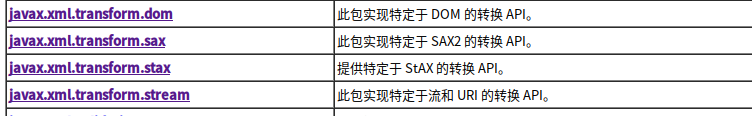

#### 什么是JAXP  
- 全称`Java API XML Processing`  
- 处理XML文档的JAVA API.  
- 对DOM,SAX,STaX,XSLT都提供了支持.  
- 详细查阅资料.  

#### 什么是DOM  
- 全称`Document Object Model`  
- 文档对象模型,基于dom树结构的方式处理XML文档.  
- 详细查阅资料.  

#### 什么是SAX  
- 全称`Simple API for XML`  
- 基于事件机制来处理XML文档.个人认为不适合创建XML文档.  
- 详细查阅资料.  

#### 什么是JDOM  

#### 什么是DOM4J  

#### JAXP的3个顶层jar包  
- `java.xml`包,此包及其子包对XML的操作定义了规范和部分实现.  
    
- `org.w3c.dom`包,DOM方式操作XML的支持接口.  
    
- `org.xml.sax`包,SAX方式操作XML的支持接口.  
    

#### `java.xml`关于解析创建的子包  
- `javax.xml.parsers` : 指允许处理XML文档的类.  
    
- `javax.xml.transform` : 定义了用于处理转换指令,以及从源到接口转换的一般API.  
    
  可参考其子包结构  
    
