1. __org.springframework.http.converter.HttpMessageConverter<T>__  
   - 将一个指定的`Class<?>`转换为另一个指定的`Class<?>`,从http的请求体或之响应体中.  
   - 同时会判断MIME类型.  
   - 简称http信息转换.  
1. __默认加载的`http信息转换`组件__  
   - 标准的spring容器环境  
     _1 : RequestMappingHandlerAdapter.messageConverters_  
     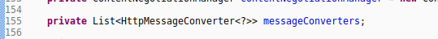  
     _2 : ctrl-alt-h_  
     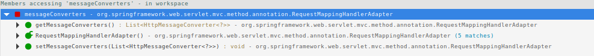  
     _3 :_  
     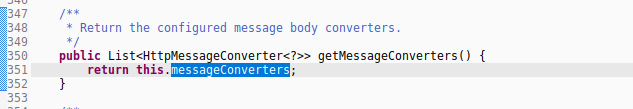  
     _4 :_  
     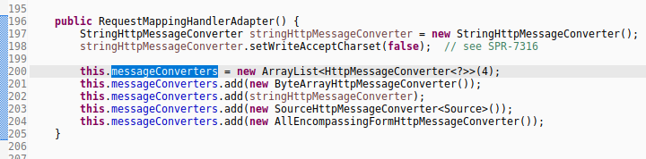  
     _5 :总结,标准环境下查看RequestMappingHandlerAdapter的构造器,可查看默认加载的http信息转换组件_  
   - 标准的springmvc容器环境  
     _1 : 启动mvc注解驱动的2种方式_  
     &#8195;xml-config中配置`<mvc:annotation-driven />`  
     &#8195;java-config中配置类级别上标注`@EnableWebMvc`  
     _2 : XSD文档指示查看注解\@EnableWebMvc_  
     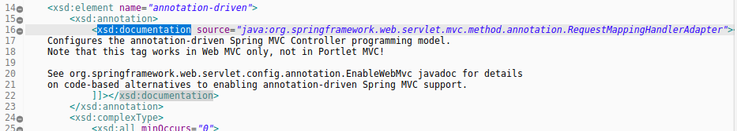  
     _3 : 详细细节阅读doc说明_  
     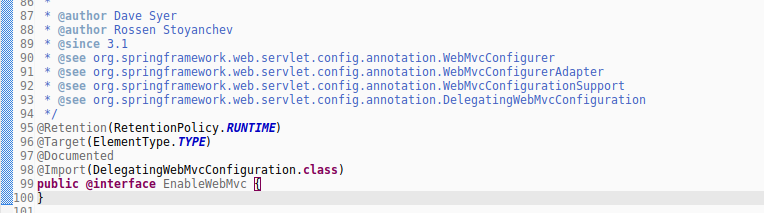  
     _4 : 直接定位DelegatingWebMvcConfiguration配置类_  
     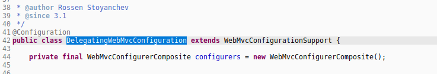  
     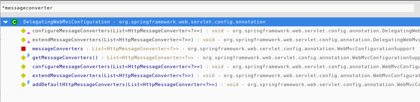  
     _5 : 追踪相关的getter方法_  
     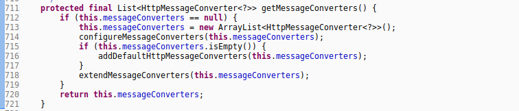  
     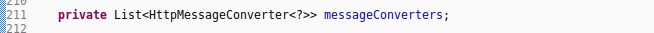  
     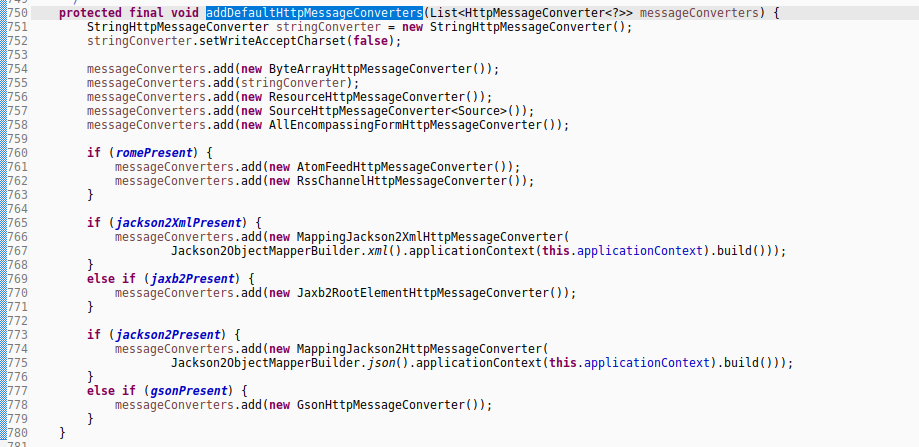  
     由`addDefaultHttpMessageConverters`方法,除了加载必要的http信息转换组件,mvc环境还会有选择性加载相应处理方式的组件.  
     _6 :总结,直接查看WebMvcConfigurationSupport.addDefaultHttpMessageConverters(List<HttpMessageConverter<?>>)方法,可知mvc环境默认加载的组件._  
1. 如何手动配置http信息转换组件  
   - 手动配置的机制  
     _查看WebMvcConfigurationSupport.getMessageConverters()的处理逻辑,可断定 : 若是手动配置加载的http信息转换组件,则默认配置的http信息转换组件则会失效._  
   - `xml-config`如何实现?  
     手动注册bean处理适配器`RequestMappingHandlerAdapter`,配置余参数`messageConverters`相关的setter方法.手动指定需要加载的http信息转换组件.  
     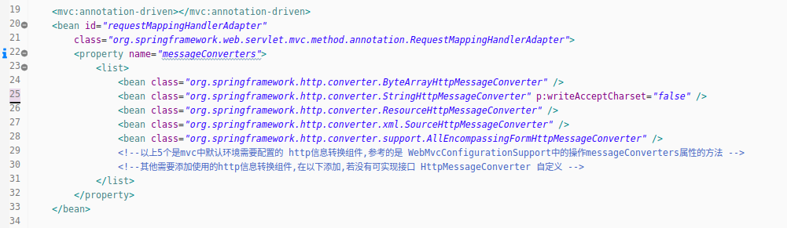  
   - `java-config`如何实现?  
     详细的配置参考注解\@EnableWebMvc的doc说明.此处简述可选`WebMvcConfigurer`,`WebMvcConfigurationSupport`配置类.(需要指出的是,若使用WebMvcConfigurationSupport配置类,应取消标注该注解)  
     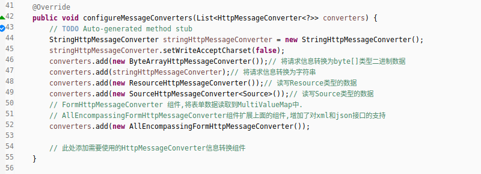  
