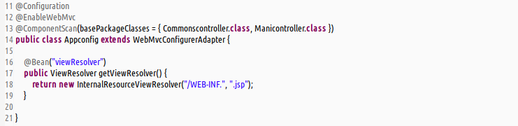
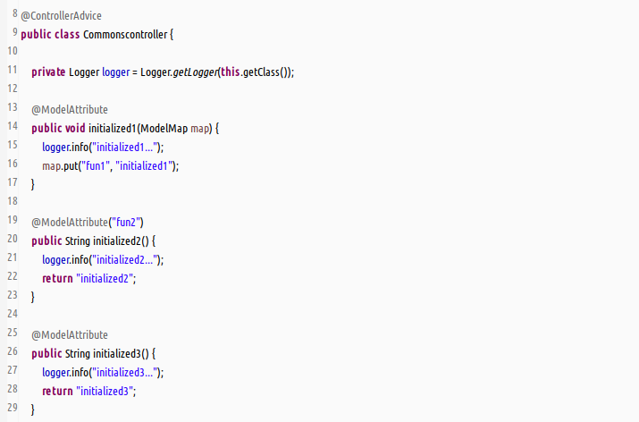
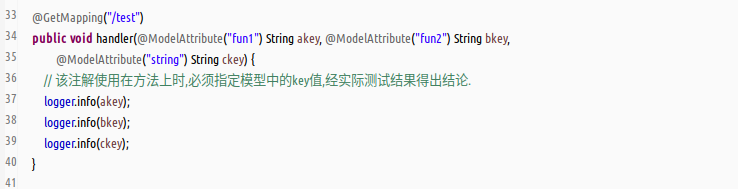
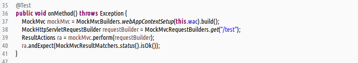
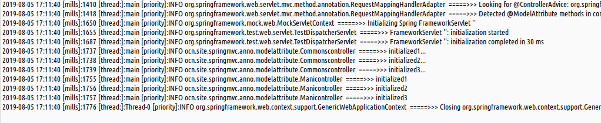
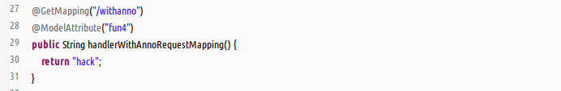
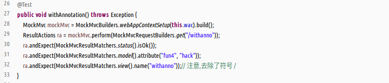
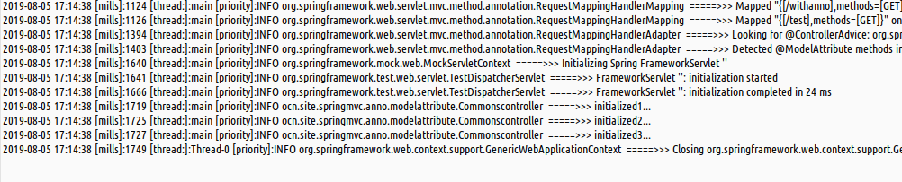

#### 提要  
1. `@ModelAttribute`效用  
   (1)使用在方法的级别上,表示controller类中的每个方法在执行之前,该方法都会被执行一次.  
   (2)使用在参数的级别上,表明从model中提取指定的key-value,绑定到方法参数上.  
1. 方法级别上的不同使用场景  
   - __\@MoldeAttribute返回void类型的方法__  
     条件 : void返回类型;注解不指定属性value的值;参数使用Model类型;  
     效用 : 将指定的key-value,绑定到model中.  
   - __\@ModelAttribute返回具体类型的方法__  
     条件 : 具体返回类型;注解不指定属性value的值;不使用Model类型参数;  
     效用 : 将指定的key-value绑定到model中,其中value是返回值,key是驼峰命名的返回类型标识符.  
   - __\@ModelAttribute("")返回具体类型的方法__  
     条件 : 具体返回类型;注解指定属性value的值;不使用Model类型参数;  
     效用 : 将指定的key-value绑定到model中,其中value是返回值.  
   - __\@ModelAttribute("")结合\@RequestMapping使用__  
     条件 : 与`@RequestMapping`同时使用;具体返回类型;注解指定属性value的值;  
     效用 : 指定的key-value绑定到model中,key-value入座规则等同上面规则.__而`@RequestMapping`中的value值是返回对应请求中的视图名称.(_注意视图名称去除符号`/`_ )__  
1. 参数级别上的使用事项  
   - 应当且推荐标记该注解的value值;  
   - 将model中指定的key-value绑定到方法参数上.  
1. 多个`@ModelAttribute`并存的执行顺序  
   __按照源码分配的先后顺序,排列在最后面的最先被调用(此结论错误,待定)__  

#### 使用  
- java-config风格配置(统一方式)  
    
1. _3种方法级别上的方式同时配置,结合使用参数上的绑定_  
     
     
     
     
1. _\@ModelAttribute("")结合\@RequestMapping使用_  
     
     
     
