#### 提要  
- `@RequestMapping`的衍生注解(便捷的restful开发模式)  
  _以下衍生注解从spring4.3版本开始新增_  
  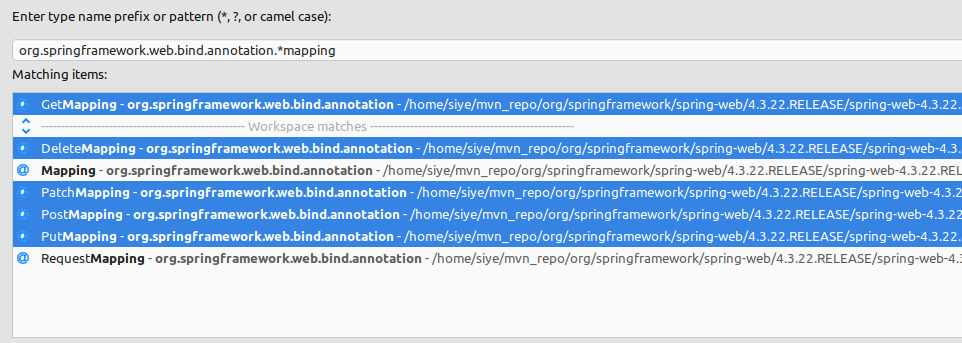  
- `@RequestMapping`属性概览  
  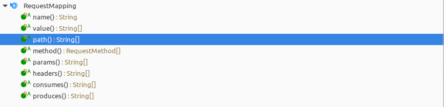  
- 补充说明  
  a.在实际的使用中,默认是推荐使用以下两个组件注册在容器中的.  
  即`RequestMappingHandlerMapping`和`RequestMappingHandlerAdapter`,这两个组件是从spring3.1开始新增的,其中一项功能是对注解`@RequestMapping`支持处理的.  
  b.基于java-config的配置中,使用注解`@EnableWebMvc`可默认注册这两个组件;  
  基于xml-config的配置中,配置`<mvc:annotation-driven />`标签,等效.  

#### 使用  
1. _使用正则表达式_  
   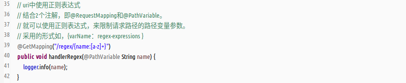  
   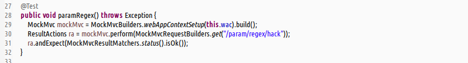  
   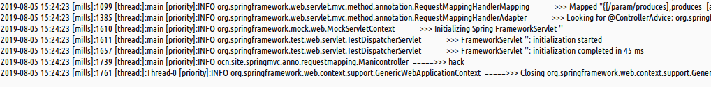  
1. _使用ant风格路径_  
   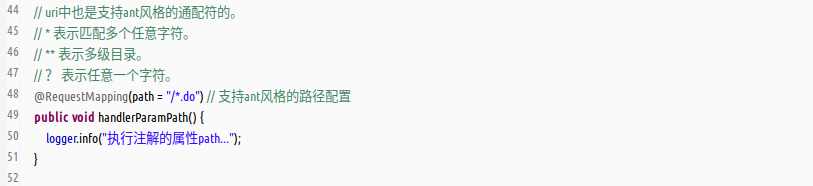  
   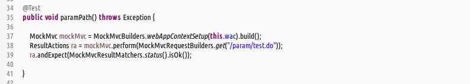  
   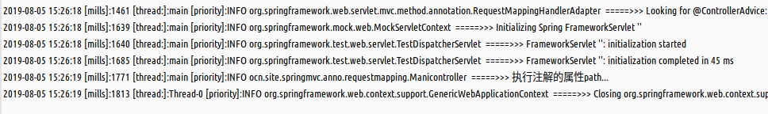  
1. _对url的请求参数进行约束_  
   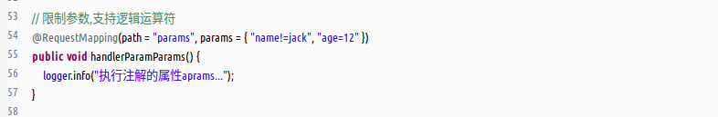  
   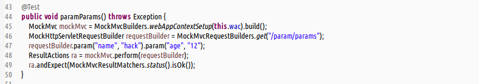  
   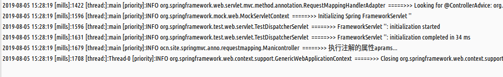  
1. _对请求的头信息header进行约束_  
   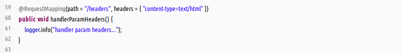  
   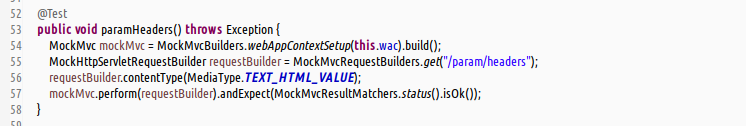  
   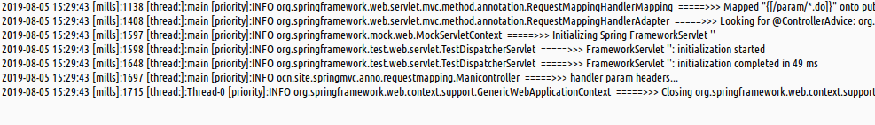  
1. _对http请求方法类型进行约束_  
   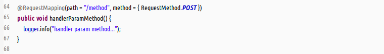  
   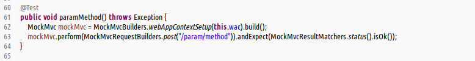  
   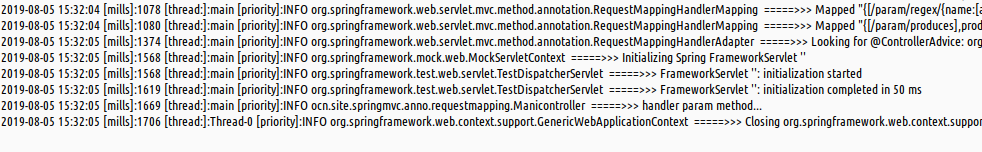  
1. _对请求体的MIME类型进行约束_  
   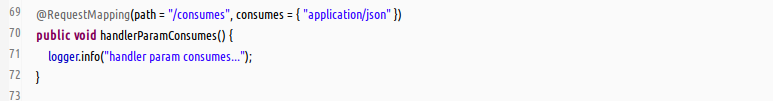  
   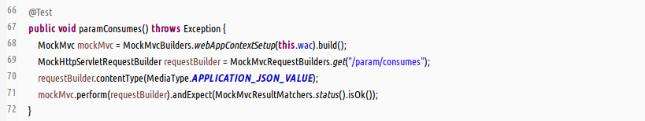  
   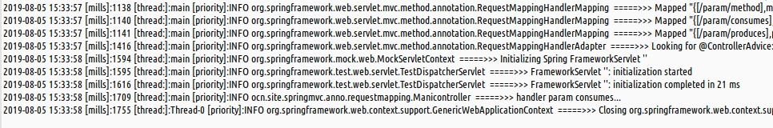  
1. _对返回体的MIME类型进行约束_  
   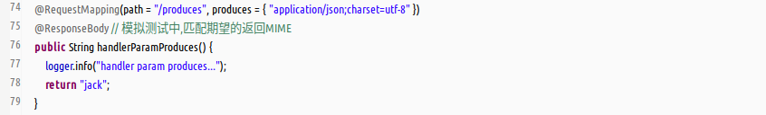  
   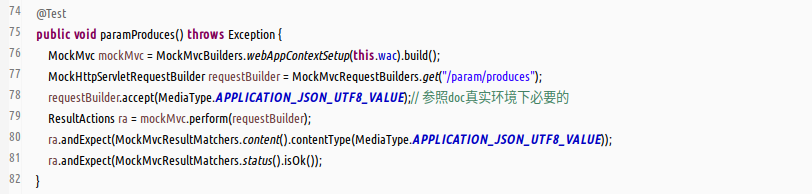  
   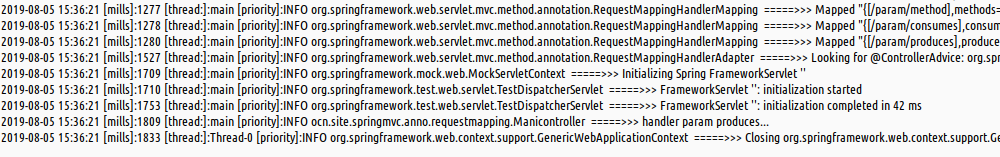  

补充 : 额外的容器配置(java-config)  
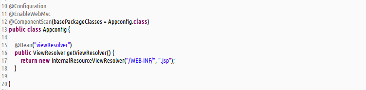  
