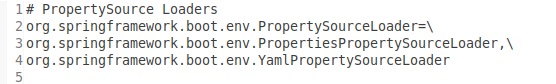
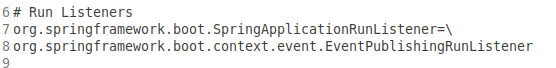
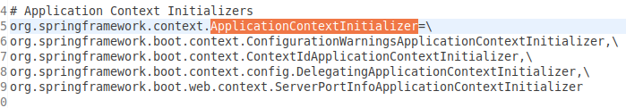
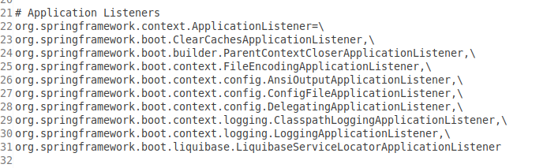
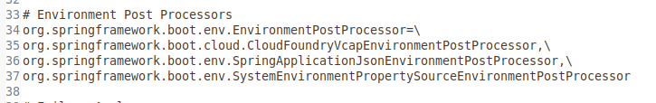

#### 该文件的作用

在 springboot 中起到至关重要的作用,主要是用来指导 springboot 找到指定的配置文件.

#### 配置文件的分析

- org.springframework.boot.env.PropertySourceLoader 的值表示的是 springboot 支持的配置文件的格式;
- `PropertiesPropertySourceLoader` : 加载 properties 和 xml 的文件格式;
- `YamlPropertySourceLoader` : 加载 yml 和 yaml 的文件格式;

- org.springframework.boot.SpringApplicationRunListener 的值表示运行时的监听器类;
- 默认加载的是`EventPublishingRunListener`;
- 默认加载的是事件监听器,在 SpringApplication 的 run 方法执行到不同的阶段时,它将对应的事件发布给 SpringApplication 的 Listener 中;

- org.springframework.context.ApplicationContextInitializer 表示应用程序的初始化类;
- `ConfigurationWarningsApplicationContextInitializer` : 报告常见的配置错误;
- `ContextIdApplicationContextInitializer` : 给 ApplicationContext 设置一个 ID;
- `DelegatingApplicationContextInitializer` : 将初始化工作委托给环境变量 context.initializer.classes 指定的初始化器;
- `ServerPortInfoApplicationContextInitializer` : 监听 EmbeddedServletContainerInitializedEvent 类型的事件,然后将内嵌的 web 服务器的端口设置到 ApplicationContext 中;

- org.springframework.context.ApplicationListener 表示 springboot 应用程序的监听器;
- `ClearCachesApplicationListener` : 在 spring 的 context 容器完成 refresh()方法后调用,用来清除缓存信息;
- `ParentContextCloserApplicationListener` : 在容器关闭时发出通知,如果父容器关闭,那么子容器也一起关闭;
- `FileEncodingApplicationListener` : 在 springboot 环境准备工作完成后运行,用来获取系统的环境变量,校验`file.encoding`和`spring.mandatory-file-encoding`的值是否一致,如果不一致就抛出异常;
- `AnsiOutputApplicationListener` : 在 springboot 环境准备工作完成后运行,如果终端支持 ANSI,则设置彩色模式的输出日志;
- `ConfigFileApplicationListener` : 用来读取 springboot 的配置文件,如 application.properties 等;
- `DelegatingApplicationListener` : 把 Listener 转发给配置的 class 处理,这样可支持外围代码不去改写 spring.factories 中的 org.springframework.context.ApplicationListener 的相关配置,保证 springboot 代码的稳定性;
- `ClasspathLoggingApplicationListener` : 程序启动时,将 classpath 打印到 debug 日志中,启动失败时打印到 info 日志中;
- `LoggingApplicationListener` : 根据配置初始化系统进行日志输出;
- `LiquibaseServiceLocatorApplicationListener` : 如果相关环境参数 liquibase.servicelocator.CustomResolverServiceLocator 存在,则使用 springboot 的相关版本替代,作用不大;

- org.springframework.boot.env.EnvironmentPostProcessor 表示 springboot 支持动态读取文件的方式;
- `CloudFoundryVcapEnvironmentPostProcessor` : 对的支持;
- `SpringApplicationJsonEnvironmentPostProcessor` : 将 spring.application.json 的 json 值转换为 MapPropertySource,并将其添加到环境属性列表源中;
