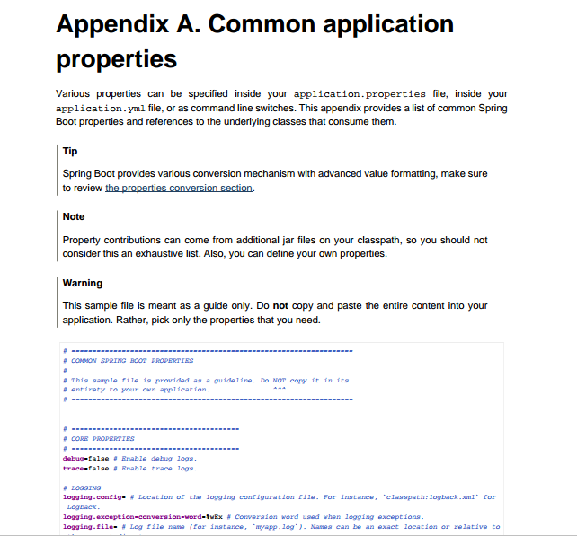
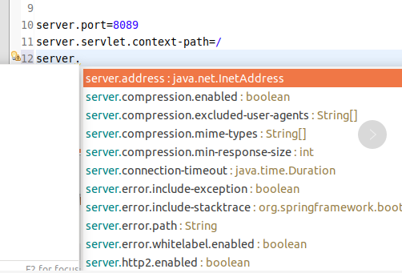

#### 配置文件的命名

springboot 的全局配置文件的命名,必须是`application`,至于文件的格式是有两种选择的,一种是 properties 文件,一种是 yml 文件.即,要么是`application.properties`文件,要么是`application.yml`文件.在 java 的大环境下,还是比较推荐使用前者.

#### 配置文件的位置

springboot 的全局配置文件,是可以自己定制的,不过文件的位置却是有明确的规范的.全局配置的文件只能放置在`src/main/resouces`的目录下,或者是根路径的`/config`目录下.  
使用场景如下图所示,一般是建议放置在`src/main/resources`目录下的 :  


#### 参考文档的帮助

在参考文档的`partX`的`appendixA`章节中,罗列出的所有的全局配置文件中的`key`值,及其相关的文档说明.有兴趣和时间的话,可一研究研究这章节.  
比如,若是要修改 tomcat 的端口号和要映射的请求路径的限制,可以按照下面进行配置 :

```properties
server.port=8089
server.servlet-context-path=/
```

以下是参考文档中的部分截图,详细的查阅参考文档 :  


#### 配置文件推荐插件

若有需求,对 springboot 的全局配置文件进行定制化,除了参考文档中的说明,在进行配置的时候,因为是人工操作的不可避免的因素,推荐使用插件进行辅助定制化.这里推荐的是 STS 插件,依据 IDE 的不同,进行对应的安装设置.  
以下是 STS 只能提示的截图 :  

