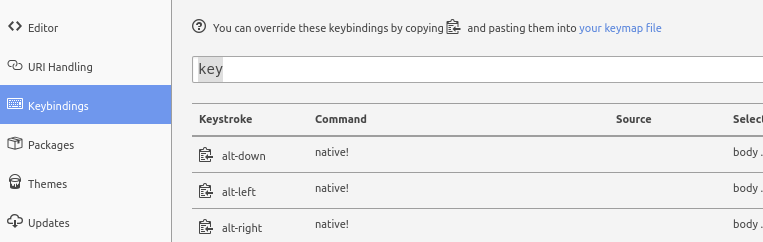
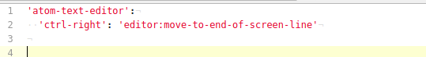
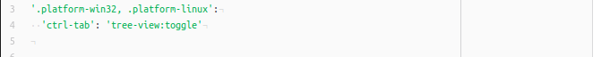

#### 重写快捷键设置方法  
- atom快捷键配置文件的位置  
  在软件安装的根目录下的隐藏文件`.atom`下,文件的名称是`keymap.cson`.  
- 如何搜索需要更改的快捷键  
  在配置模块中的,快捷键模块中关键字搜索.  
    

#### 自定义的快捷键汇总  
1. 配置快捷键,直接跳转行尾  
     
1. 重写覆盖切换菜单栏快捷键`ctrl-\\`  
     

#### 默认可使用快捷键备忘  
`alt-shift-a` : 多行选择,使用up和down键位操控  
`ctrl-shift-k` : 删除整行  
