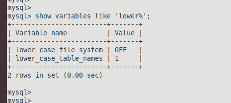

- 声明  
  因版本不同和数据库的不同(mysql和mariadb)配置文件和变量名称可能有些许的出入,但是大体上是不变的.  
- 查看相关的配置变量  
  (1)`character%`变量  
    
  (2)`collation%`变量  
    
  (3)`lower%`变量  
    
- 补充,若想查看数据库配置的变量集合,在ubuntu中的终端中输入`mysql --help`可查看.  
    
- 
  备忘环境为`ubuntu18.0.4`,数据库版本是  
  `mysql  Ver 14.14 Distrib 5.7.26, for Linux (x86_64) using  EditLine wrapper`  
  数据库安装的方式使用的是`apt-get install mysql-server mysql-client`  
  需要修改的配置文件位置是`/etc/mysql/my.cnf`  
  修改信息参考如下截图  
    
- 参考文章  
  `https://blog.csdn.net/daijiguo/article/details/78102622`  
  `https://blog.csdn.net/ddkking/article/details/79973749`  
  `https://blog.csdn.net/weixin_42513315/article/details/82463932`  
