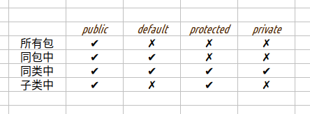

1. 访问权限修饰符  
     
1. 中断流程控制修饰符  
   - `break`,`continue`,`return`  
   - 具体说明查看关于`流程控制`的笔记.  
1. 涉及`对象和接口`的修饰符  
   - `this` : 表示本类  
   - `super` : 表示父类  
   - `extends` : 表示继承  
   - `implements` : 表示实现  
   - `abstract` : 表示抽象类或之抽象方法  
1. this和super修饰符的区别  
   - this修饰符  
     _1 : 在方法中,表示隐式参数.Java中每个普通方法的第1个参数都是隐式参数,使用this表示.表示的是方法所属类的对象的实例._  
     _2 : 调用本类中的成员属性,`this.attrIndentifier`_  
     _3 : 调用本类中的构造器,`this()`或之`this(argument)`_  
   - super修饰符  
     _1 : 一般在子类中使用_  
     _2 : 可使用此修饰符调用父类的属性和方法_  
1. 其他修饰符  
   - `strictfp` : 约定jvm处理浮点计算时采用严格的计算方式.  
   - `volatile` : 并发线程处理中设置共享变量.  
   - `import` : 导入借用的外部类(可批量导入).  
   - `package` : 将本类打包到指定的jar包中.  
   - `import static` : 静态导入,jdk1\.5的新特性.  
   - `final` : 修饰类表示此类所有状态不可变;修饰方法表示此方法不可被`@Override`;修饰属性表示常量.  
