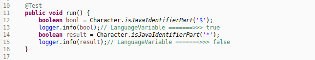

1. __标识符规范__  
   - 由字母,数字,美元符号和下划线组成.  
   - 不能以数字开头.  
   - 不能使用Java中的关键字和保留字.  
   - 不建议使用美元符号.  
   - 建议使用字母作为开头,若是类名首字母应当大写.  
   - 建议使用驼峰命名法.  
   - 严格的区分大小写.  
   - 在同一作用域中,标识符不能重复.  
   - _是否是合法的标识符使用java\.lang\.Character中的静态方法可测试._  
       
1. __变量分类__  
   - 加载方向分类  
     _1 : 非静态变量,未使用static修饰符._  
     _2 : 静态变量,使用static修饰符._  
   - 作用域方向分类  
     _1 : 全局变量,别称实例变量,成员变量._  
     _2 : 局部变量._  
1. __变量识别__  
   - 全局变量  
     _1 : 在类中且是局部块外部声明的变量._  
     _2 : 全局变量的声明若未手动初始化,一般都会缺省初始化的._  
   - 局部变量  
     _1 : 在非静态或之静态局部块中声明的变量._  
     _2 : 在类的方法中声明的变量._  
   - 全局静态变量  
     _1 : 使用static修饰的全局变量,别称类变量._  
   - 局部静态变量  
     _1 : 使用static修饰的局部变量._  
     _2 : 类加载机制,此种变量只能在静态方法中声明._  
     _3 : 也因类加载机制,在静态方法中使用static修饰变量无意义._  
   - 常量  
     _1 : 常量使用final修饰符修饰._  
     _2 : 常量一旦被初始化,就不可更改._  
   - 静态常量  
     _1 : 静态常量使用final static修饰符修饰._  
     _2 : 静态常量一般推荐使用大写字母命名._  
1. __变量声明__  
   - 规范的推荐方式,在声明变量的同时,进行手动初始化.  
     `int num = 12;`  
   - 不规范方式,全局变量,缺省初始化.  
     `class A{ int num; }`  
   - 规范方式,局部变量的声明,必须手动初始化.  
     `class A{ { int num = 12; } }`  
   - 不规范的方式,多个变量同时声明.  
     `int num0,num1,num2;`  
     `int num0=0,num1=1,num2=2;`  
   - _在嵌套的语句块中,不能声明同名的两个变量._  
