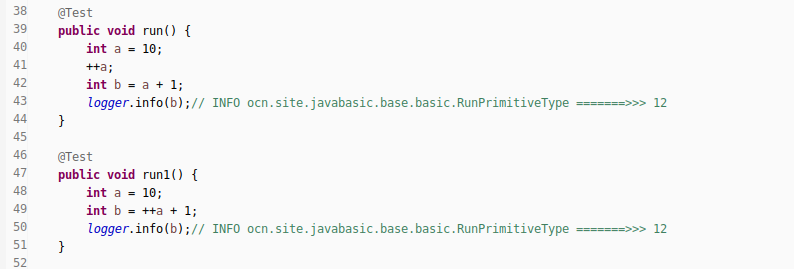
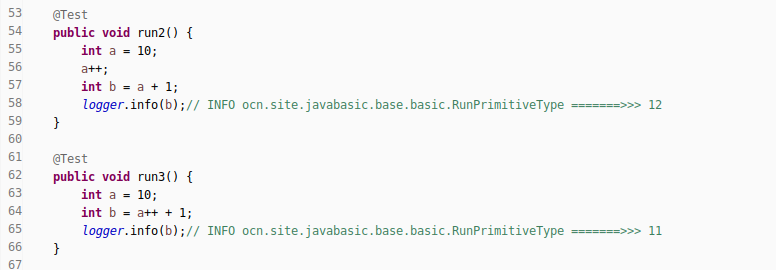
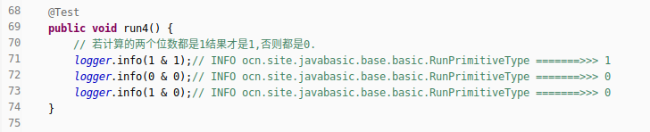
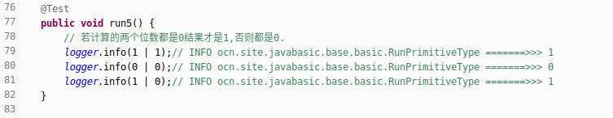
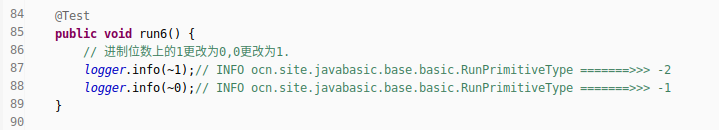
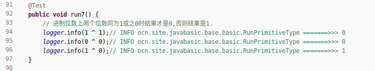
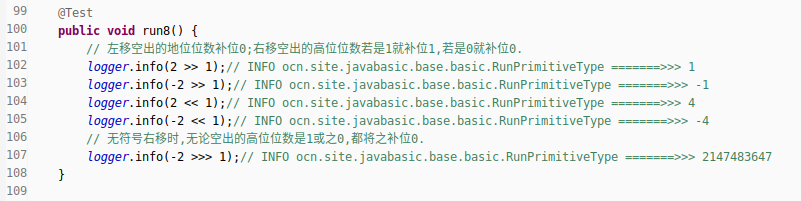

1. Java支持的操作符(operation symbol)  
1. 赋值运算符`=`  
   - 给原始类型数据赋值.  
   - 给对象实例赋予引用地址的关联.  
   - `boolean bool = false;`  
1. 基本算数运算符  
   - 加法运算(+) : `int num = 2 + 3;`  
   - 减法运算(-) : `int num = 4 - 1;`  
   - 乘法运算(\*) : `int num = 4 * 3;`  
   - 除法运算(\/) : `int num = 10 / 2;`  
   - 取余运算(\%) : `int num = 10 % 3; //输出结果为1`  
   - _其中赋值运算符可和基本算数运算符任意组合,比如`x+=2;`_  
1. 自增自减运算符  
   - 自增运算符使用符号`++`.  
   - 自减运算符使用符号`--`.  
   - __置于前面,先自运算,再参与表达式运算.__  
     __置于后面,先参与表达式运算,再自运算.__  
   - 简单实例  
       
       
1. 比较运算符  
   - 属于二元运算符,返回结果是布尔类型.  
   - 约计6种符号`>`,`<`,`=`,`>=`,`<=`,`==`,`!=`.  
   - 实例比如`boolean bool = 1 > 2; // 返回结果是false`  
1. 逻辑运算符  
   - 与或非逻辑运算符号.  
   - 符号有如下`&`,`&&`,`|`,`||`,`!`.  
   - 属于二元运算符.  
   - 连续两个符号定位短路运算,表示左边的表达式能确定结果,那么右边的表达式就不予运算.  
1. 三元运算符  
   - 格式语法为 : `二元表达式 ? 值1 : 值2;`  
   - 二元表达式的结果是true,则返回值1,反之则返回值2.  
1. 位运算符  
   - 注意事项  
     (1)位运算只能操作整数和字符类型.  
     (2)补充,除了按位与和按位或运算,其它运算符只能操作整数.  
   - 与运算  
       
   - 或运算  
       
   - 取反运算  
       
   - 按位异或运算  
       
   - 位移运算  
       
1. 运算符的优先级  
   - 自增自减运算>算术运算符>比较运算符>逻辑运算符>赋值运算符.  
   - 推荐使用括号,既保证准确性,又增加可读性.  
