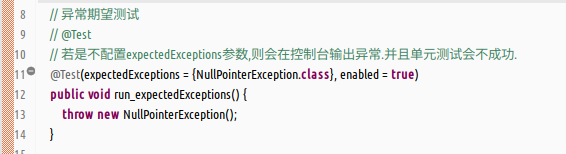
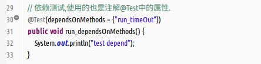
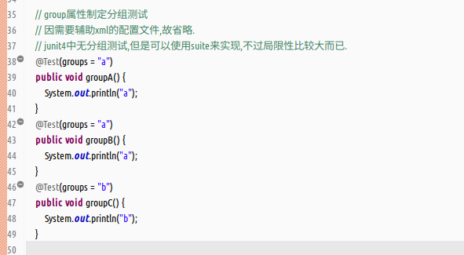
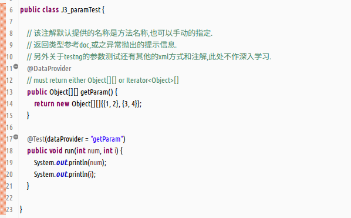

#### 提要  
- testng简介  
  (1)用来简化广泛测试需求的测试框架.  
  (2)基于junit和nunit,并相对于它们在功能上进一步扩展.  
  (3)很大的程度上借鉴了jdk5的注解来定义测试的.  
  (4)testng增加了装置灵活,分类测试,参数测试,依赖测试,数据驱动测试等新的功能,这是junit所没有的.  
- testng的生命周期  
  生命周期概览  
  (1)类级资源初始化处理;  
  (2)方法级资源初始化处理;  
  (3)执行单元测试实例;  
  (4)方法级资源销毁处理;  
  (5)类级资源销毁处理;  
  关于testng生命周期的几点说明:  
  (1)关于资源的初始化和销毁的方法,在类级的级别上,只会在类加载的时候运行一次;在方法的级别上,每次单元测试执行,都会执行一次;  
  (2)关于资源初始化和销毁方法的执行顺序,在这里是不区别于类级和方法级的.针对于资源初始化的方法,按照源码的排行顺序,末尾的先执行,然后倒序依次执行;针对于资源销毁的方法,则是按照源码的排版顺序依次执行.  
  (3)对于资源销毁的方法`@AfterMethod`和`@AfterClass`,即使单元测试的方法,或之资源初始化的方法抛出异常,标记的资源销毁方法也会依旧的执行.  
- 工具演示要求  
  在IDE中,例如eclipse是需要安装testng的插件的.插件的名称是`TestNG for Ecelipse`.因需要使用到其他的插件,比如STS,故推荐eclipse的版本为`4.9`,既支持testng的插件,又支持STS的插件.  
- 测试时使用的testng的版本,mvn:`/org.testng/testng/6.9.10`  

#### 演示  
- 基本的注解测试(查看相关的doc和源码)  
  (1)`@BeforeClass`:在测试类加载的时候执行,参考doc,必须标记为静态方法,用于资源初始化.  
    
  (2)`@AfterClass`:在测试类执行结束后执行,在方法级销毁方法执行之后执行,参考doc必须标记为static.  
    
  (3)`@BeforeMethod`:每个单元测试执行之前执行,用于资源初始化.  
    
  (4)`@AfterMethod`:每个单元测试执行之后执行,用于资源销毁,先于方法级别的资源销毁方法.  
    
  (5)`@Test`:执行单元测试,类似junit中的注解,但功能更加的丰富.  
    
- 注解`@Test`部分详解(详细查看源码和doc)  
  (1)异常期望测试,使用注解中的`expectedExceptions`方法.  
    
  (2)超时制定测试,使用注解中的`timeOut`方法.  
    
  (3)依赖方法测试,使用注解中的`dependsOnMethods`方法.  
    
  (4)分组规划测试,使用注解中的`groups`方法,目前所知,需要借助xml配置文件来进行搭配,截图示例不会成功,仅做标记.  
    
- testng支持的参数化测试  
  (1)虽然junit4也支持参数测试,但是testng的使用相比较来说,是很简单方便的,只要使用注解`@DataProvider`.  
  (2)注解标记的方法,用来存储测试所需的数据,在`@Test`标记的方法参数中,直接调用即可.具体的限制规则查看该注解的doc.  
    
- 后记,此笔记仅使用testng常用且简单的几个注解和功能,详细原理和使用参考书籍未列出,待续!  
