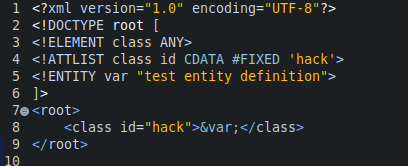
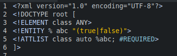
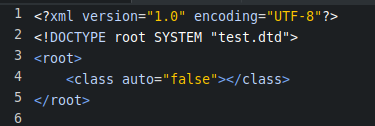

#### 普通实体  
- 定义  
  就是用一个字符串替代另一个字符串.  
- 定义语法  
  `<!ENTITY 实体名 '实体值'>`  
- 调用语法  
  `&实体名;`  
- 示例  
    

#### 参数实体  
- 定义  
  只能在DTD内部中使用的实体.  
- 语法  
  `<!ENTITY % 实体名 '实体值'>`  
- 调用  
  `%实体名;`  
- 示例  
  dtd文件  
    
  xml文件  
    
- 注意!  
  参数实体,在引入内部DTD的方式中,是非法的,会报错解析错误.  

#### 其他参考  
- 外部实体  
  `<!ENTITY 实体名 SYSTEM "实体值所在文件的URI">`  
- 外部参数实体  
  `<!ENTITY % 实体名 SYSTEM|PUBLIC ["公用实体标识名"] "实体值所在文件的URI">`  
