#### 复杂类型提要  
- 什么是简单类型  
  (1) 元素内容是简单类型;  
  (2) 元素不能包含属性  
- 什么是复杂类型  
  (1) 元素内容是简单类型,但包含属性.使用`simpleContent`.  
  (2) 包含子元素的元素;空元素;包含混合内容的元素.使用`complexContent`.  
- 定义复杂类型使用XSD的哪个内建元素?  
  complexType  
- 定义复杂类型的2种方式  
  (1) 全局命名的复杂类型  
  (2) 局部匿名的复杂类型  

#### complexType元素详解  
- 定义  
  此元素用来定义复杂类型.  
- 支持的属性  
  (1) `id` : 全局下的唯一标识ID.  
  (2) `name` : 定义该类型的名称.  
  (3) `abstract` : 在实例文档中是否可以使用复杂类型.  
  &#8195;设置为true,元素不能直接使用此复杂类型,只能使用其派生的复杂类型.  
  &#8195;设置为false,反之,为默认值.  
  (4) `mixed` : 是否允许字符串数据出现在该元素的子元素之间.默认是false.  
  &#8195;a. 若使用的是`simpleContent`子元素,则不允许出现`mixed`属性;  
  &#8195;b. 若是`complexContent`子元素,则该属性的值,可以会被这个子元素的属性`mixed`重写.  
  (5) `block` : 是否限制其他复杂类型替代此复杂类型.  
  &#8195;候选值有extension,restriction,#all.  
  (6) `final` : 是否限制该复杂类型派生新的复杂类型.  
  &#8195;候选值有extension,restriction,#all.  
  (7) `any attributes` : 规定带有non-schema命名空间的其他任何属性.  
- 支持的父元素  
  `element`,`redefine`,`schema`  
- 支持的子元素  
  `(annotation?,(simpleContent|complexContent|((group|all|choice|sequence)?,((attribute|attributeGroup)*,anyAttribute?))))`  

#### simpleContent元素详解  
- 定义  
  创建包含简单类型内容或之包含属性的复杂类型.  
- 支持的属性  
  (1) `id` : 全局下的唯一标识ID.  
  (2) `any attibutes` : 规定带有non-schema命名空间的其他任何属性.  
- 支持的父元素  
  `complexType`  
- 支持的子元素  
  `(annotation?,(restriction|extension))`  
- 使用示例  
  (1) 使用extension派生简单类型  
  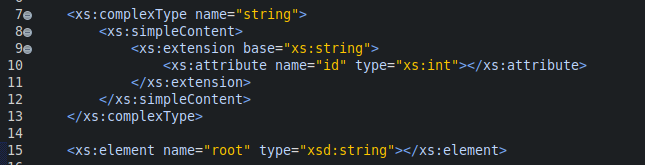  
  (2) 使用extension派生复杂类型  
  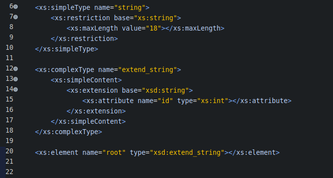  
  (3) 使用restriction派生复杂类型  
  &#8195;补充,该`restriction`元素的使用场景  
  &#8195;a. 进一步限制元素的内容或属性;  
  &#8195;b. 删除元素的某个属性;  
  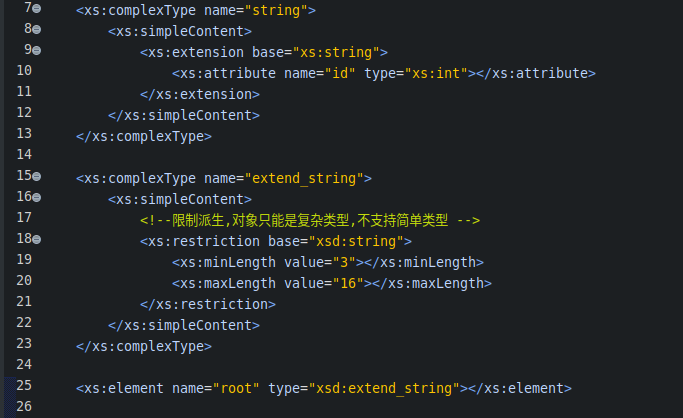  
  (4) 使用`xsi:type`派生复杂类型  
  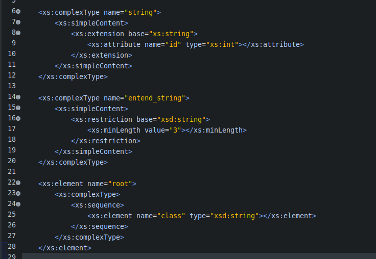  
  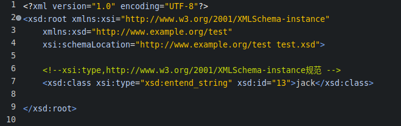  

#### complexContent元素详解  
- 定义  
  定义包含子元素;空元素;混合内容的复杂类型.  
- 支持的属性  
  (1) `id` : 全局下的唯一标识ID.  
  (2) `mixed` : 是否允许字符串出现在该类型的子元素之间.默认值false.  
  (3) `any attributes` : 规定带有non-schema命名空间的其他任何属性.  
- 支持的父元素  
  `complexType`  
- 支持的子元素  
  `(annotation?,(restriction|extension))`  
- 使用示例  
  (1) 限制内建类型anyType的机制  
  规则说明: Schema约定,如果某个复杂类型由anyType限制派生而来,那么在约束这个元素的时候,可以省略`complexContent`和`restriction`元素,而直接使用`all`,`group`,`chioce`,`sequence`.  
  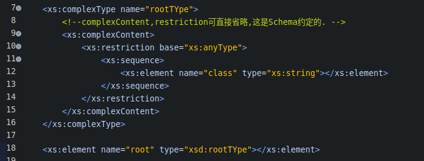  
  (2) 使用complexContent创建包含子元素的复杂类型  
  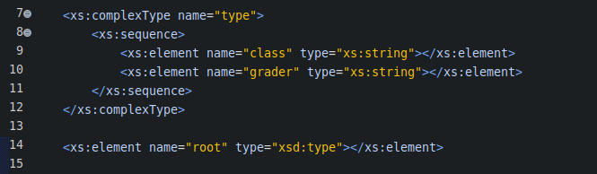  
  (3) 使用complexContent创建包含空元素的复杂类型  
  &#8195;约束空元素的复杂类型的2种方式  
  &#8195;a. 限制字符串的长度为0;  
  &#8195;b.限制anyType类型,内部不声明任何元素;(推荐常用方式)  
  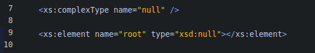  
  使用不推荐的方式约束空元素  
  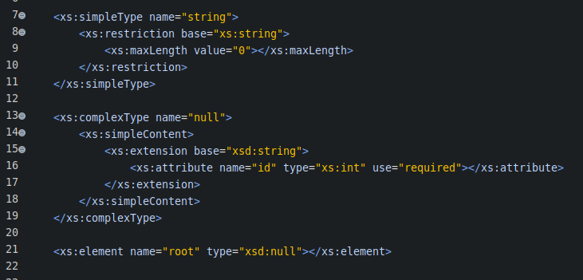  
  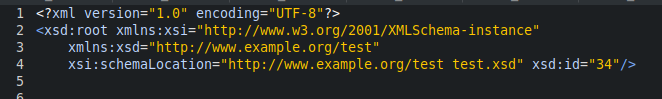  
  (4) 使用complexContent创建包含混合内容的复杂类型  
  &#8195;什么是混合类型?DTD中的术语规范,查看相关笔记.  
  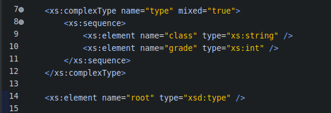  
  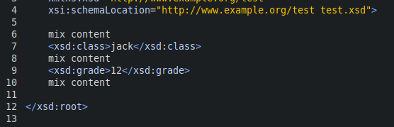  
