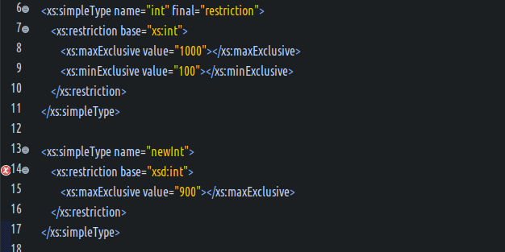
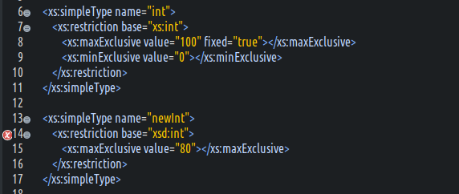

#### 使用final限制类型派生  
- 定义  
  限制定义的类型,衍生出新的派生类型,可作用在`simpleType`或之`complexType`元素上.表现是属性`final`.  
- final属性支持的元素  
  simpleType  
  complexType  
- final支持的候选值  
  (1) 当作用在simpleType元素上  
  `#all` : 限制任何形式的派生  
  `restriction | list | union` : 任意形式的组合,1个以上使用空格隔开.比如使用list,表示限制list形式的派生.  
  `""` : 默认值,取值schema根元素finalDefault的设置.  
  (2) 当作用在complexType元素上  
  `#all`  
  `extension`  
  `restriction`  
- 在simpleType元素上使用示例  
    

#### 使用fixed限制内建约束派生  
- 什么是约束覆盖  
  (1) 在对一个已有的类型派生新的类型时,如果新的类型和原有的类型约束类型相同,且约束的名称也相同,则新的约束值会覆盖原有的约束值.这种情况就称作约束覆盖.  
  (2) 如果为原有的类型指定`fixed="true"`,就可以阻止约束覆盖的机制.  
- fixed属性支持的值  
  true  
  false  
- 阻止约束覆盖后,在编写XSD的时候,就会提示报错.  
- 使用示例  
  

#### block属性  
&#8195;查阅XSD参考手册.  
