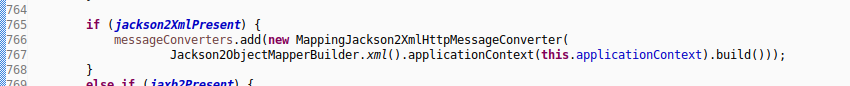
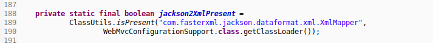
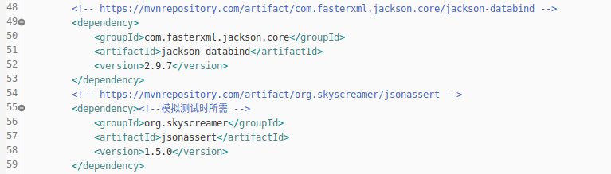
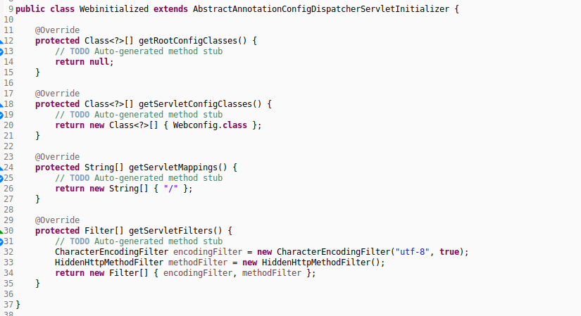
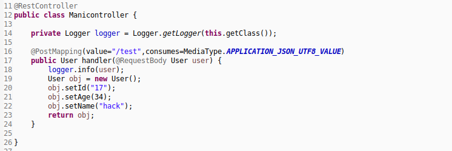
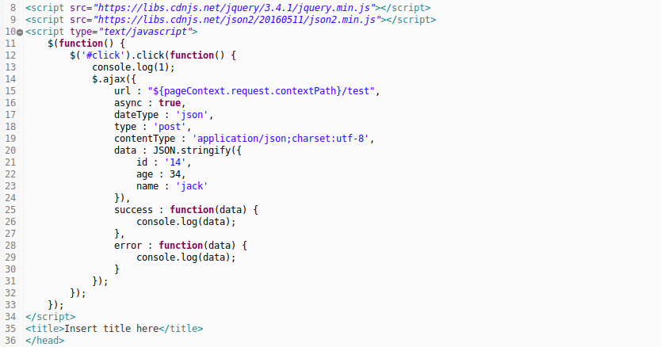
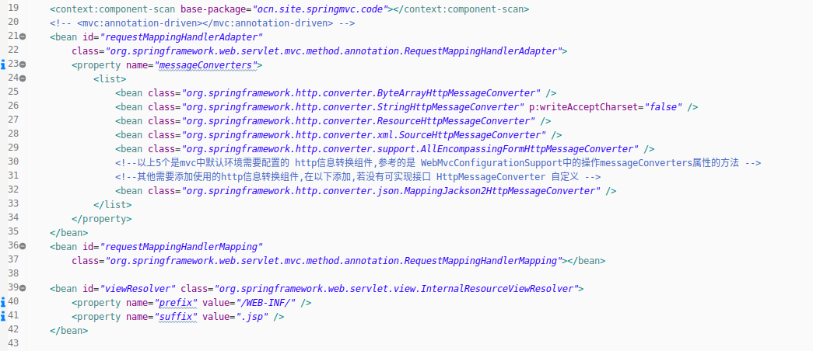
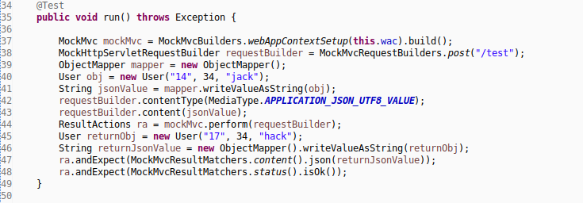
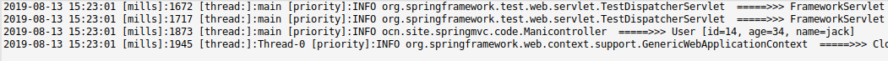

#### 提要  
1. 转换jackson2相关的http信息转换组件,详细查看关于HttpMessageConverter接口的笔记.  
1. 参考WebMvcConfigurationSupport\.addDefaultHttpMessageConverters()方法,定位默认的相关组件.  
     
     
1. 添加相关的资源依赖  
     
     
     
1. 使用到的相关核心注解  
   - `@RequestBody` : 将请求的json数据封装到pojo对象;  
   - `@ResponseBody` : 将响应的pojo对象封装到json数据中;  
   - `@RestController` : 便捷的Restful支持的控制器注解,使用可统一省略注解\@ResponseBody;  

#### 使用  
1. 真实容器环境的配置  
     
     
     
1. 控制器配置  
     
1. ajax信息配置  
     
1. 输出结果省略  

#### 模拟  
1. _xml-config配置文件_  
     
1. _控制器复用_  
1. _模拟测试_  
     
1. _输出结果_  
     
