#### 提要  
1. _springmvc标准环境中默认加载有处理xml的http信息转换组件_  
   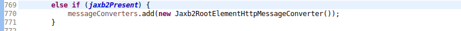  
   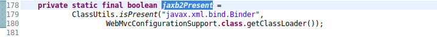  
1. _只要注册mvc注解驱动组件_  
   - 使用注解\@EnableWebMc  
   - xml\-config中使用标签`<mvc:annotation-driven />`  
1. _模拟测试中需要额外添加xmlunit资源包_  
   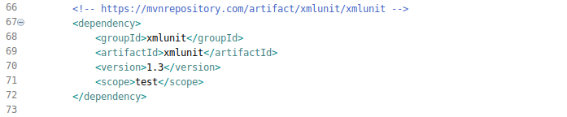  
1. _需要jaxb相关知识_  

#### 使用  
1. __标准springmvc环境配置__  
     
   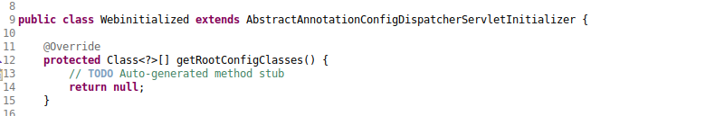  
   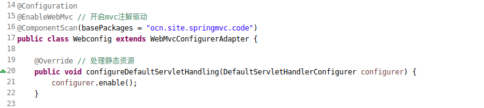  
1. __控制器配置__  
   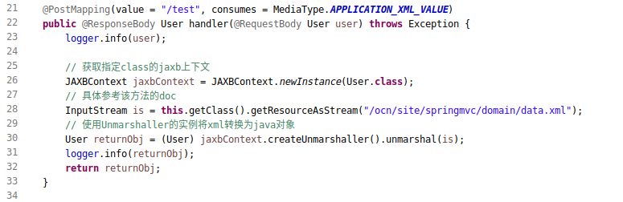  
1. __pojo配置__  
   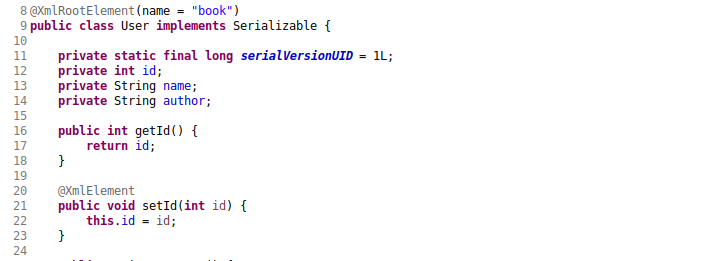  
1. __ajax配置__  
   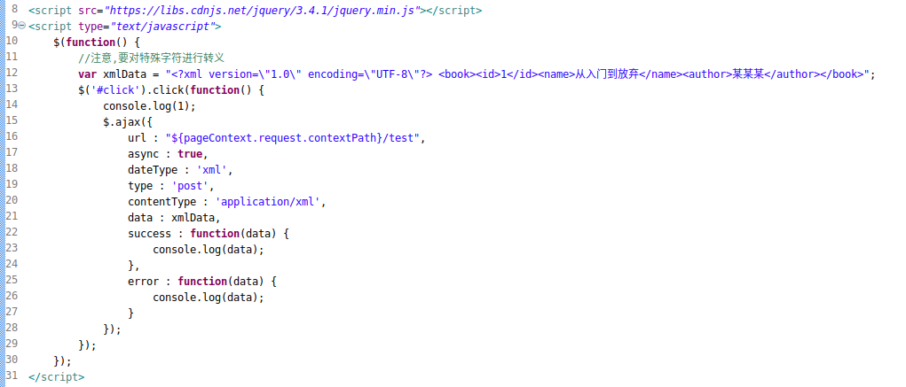  
1. __测试输出省略__  

#### 模拟  
1. _xml-config配置_  
   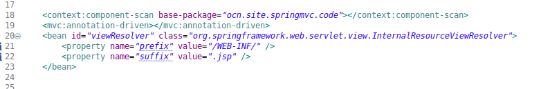  
1. _控制器配置省略_  
1. _模拟测试_  
   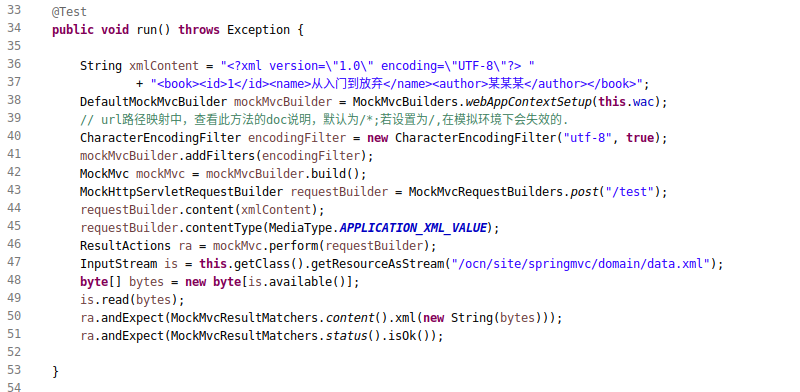  
1. _测试输出信息_  
   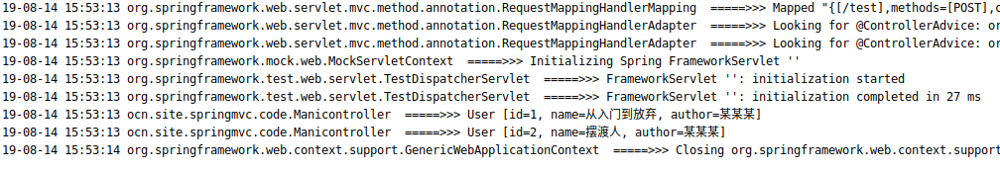  
