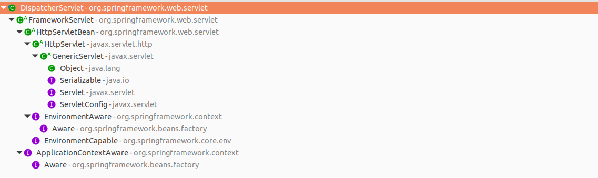
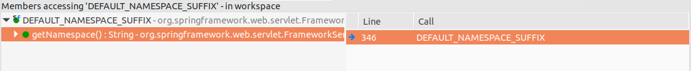
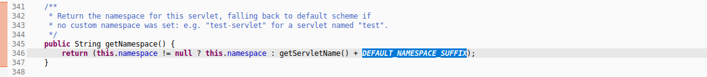
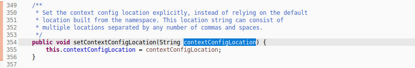
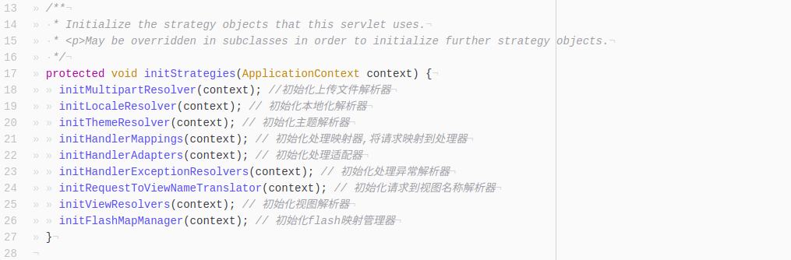
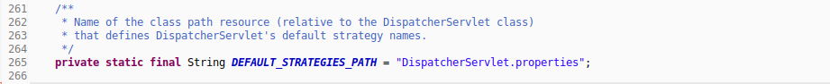
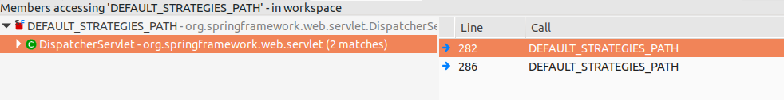
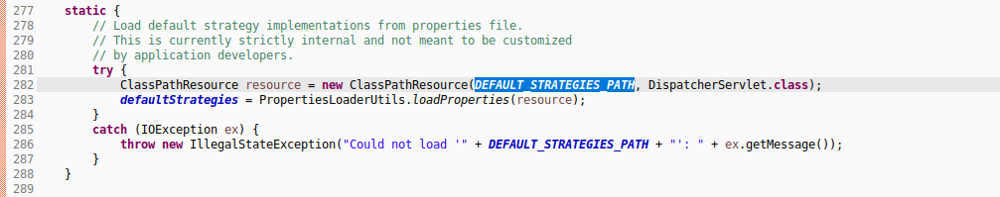
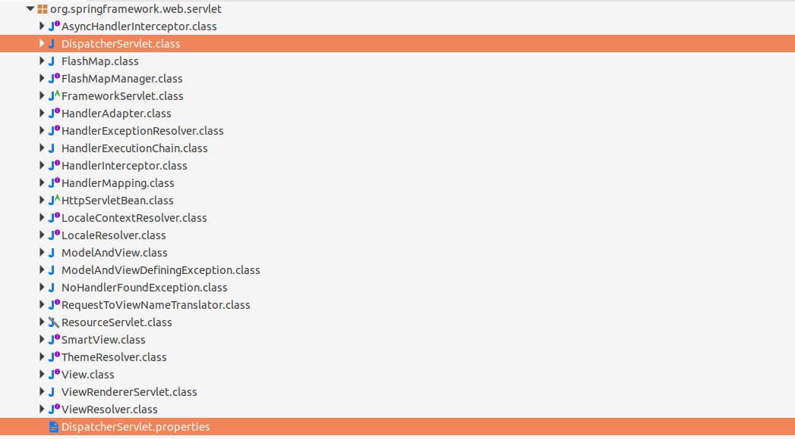

- API关系树图  
    
- 关于前端控制器加载的配置文件设置.  
  (1)a.配置文件默认的加载路径`/WEB-INF/[servlet-name]-servlet.xml`  
  &#8195;b.参考父类`FrameworkServlet`的静态变量  
    
  &#8195;c.查看调用它的执行语句  
    
  &#8195;d.以下代码,其效用是获取命名空间`[servlet-name]-servlet`  
  &#8195;e.真正调用配置文件语句不在此处,但可推断调用处使用了该返回值.  
    
  (2)a.上一点是默认情况加载配置文件的路径.  
  &#8195;b.要手动指定,则需在`web.xml`文件中指定初始化参数`contextConfigLocation`.  
  &#8195;c.其值是配置文件的路径,推荐使用`classpath:`或之`classpath*:`导航.  
  &#8195;d.配置文件命名无特殊要求,遵循标准的命名规范.  
  &#8195;e.同样参考父类中的`setter`方法.  
    
- 前端控制器的初始化策略  
  (1)查看该类的初始化策略方法  
  a.该方法会在`WebApplicationContext`初始化后自动执行;  
  b.自动扫描上下文中的bean,根据名称或类型匹配机制查找自定义的组件;  
  c.若找不到,则会装配一套默认的spring组件;  
    
  d.该默认的spring组件,查看前端控制器的静态变量;  
    
  e.调用该变量的执行语句  
    
  f.是本类中的静态方法块,由执行语句推测可能从当前路径中加载  
    
  g.验证推测  
    
