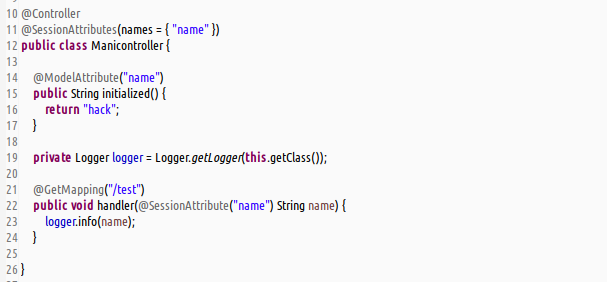
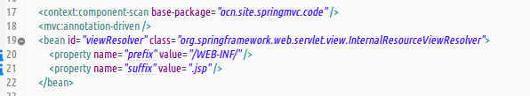
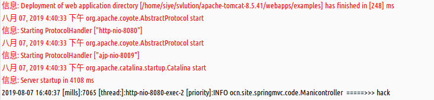

#### 提要  
1. \@SessionAttributes : 使用在方法级别上的注解,将model中的key-value,暂存到httpsession中.  
1. 可提取指定name的model中的key-value,使用注解的names属性.  
1. 可提取指定类型的model中的key-value,使用注解的types属性.  
1. 真实环境测试,可使用request或之\@SessionAttribute提取.但是测试环境中无法实现.  

#### 使用  
1. 控制器使用  
     
1. _xml-config_ 风格配置  
     
1. _web.xml_ 文件配置省略  
1. 路径测试触发输出结果  
     
