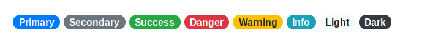
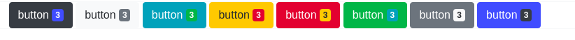

#### css 样式概览

| CSS 类             | 描述               |
| :----------------- | :----------------- |
| `.badge`           | 必选,默认,方体形状 |
| `.badge-pill`      | 药丸形状           |
| `.badge-success`   | 深蓝色             |
| `.badge-secondary` | 深灰色             |
| `.badge-success`   | 绿色               |
| `.badge-danger`    | 红色               |
| `.badge-info`      | 黄色               |
| `.badge-warning`   | 浅蓝色             |
| `.badge-light`     | 浅灰色             |
| `.badge-dark`      | 黑色               |

#### 使用说明

(1)  
badge 组件一般使用在`span`或者是`a`元素上,当然也可以将这些元素内嵌到`buuton`元素,以起到内嵌信息的效果等.  
(2)  
若是要使用默认的样式,采用如下的格式 :  
`徽章`  
(3)  
若是要使用药丸形状的徽章,则采用下面的形式 :  
``

#### 组件样式颜色规划预览

默认的样式 :  
  
药丸形状的样式 :  
  
嵌套样式的预览 :  

