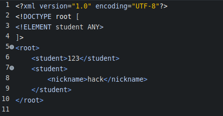
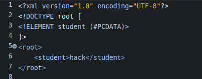
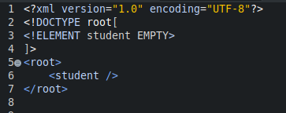
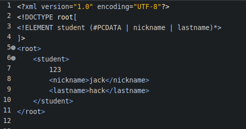

#### 语法格式  
&#8195;`<!ELEMENT 元素名 元素类型描述>`  

#### 描述元素类型的5种分类  
- 任意类型`ANY`  
- 字符串值`#PCDATA`  
- 空元素`EMPTY`  
- 包含子元素  
- 混合类型  

#### 约束可包含任意类型的元素  
- 语法  
  `<!ELEMENT 元素名 ANY>`  
- 示例  
    
- 说明  
  可包含字符串值,空元素,包含子元素,混合类型.  

#### 约束字符串值的元素  
- 语法  
  `<!ELEMENT 元素名 (#PCDATA)>`  
- 示例  
    
-  注意,`#PCDATA`需要使用括号包裹.  

#### 约束空元素的元素  
- 语法  
  `<!ELEMENT 元素名 EMPTY>`  
- 示例  
    
- 注意,也可以使用双标签,但内部不能有任何标签和字符.  

#### 约束包含子元素的元素  
- 有序的子元素  
  `<!ELEMENT 父元素 (子元素1,子元素2,子元素3)>`  
- 互斥的子元素  
  `<!ELEMENT 父元素(子元素1 | 子元素2 | 子元素3)>`  
- 子元素出现的4种频率约束  
  (1) 括号后面什么也不添加,表示必须且只能出现1次;  
  (2) `*` : 表示0次或之多次;  
  (3) `+` : 表示1次或之多次;  
  (4) `?` : 表示0次或之1次;  
- 组合子元素  
  `<!ELEMENT 父元素 ((子元素1,子元素2)+,子元素3,子元素4)>`  
  使用括号和频率操作符号,可任意组合嵌套.  
- 无序的子元素  
  `<!ELEMENT 父元素 (子元素1 | 子元素2 | 子元素3)+>`  

#### 约束混合类型的元素(不推荐)  
- 什么是混合类型?  
  xml中的一个标签内,既可以包含字符串数据,也可以包含子元素,这种情况即支持包含混合类型的元素.  
  这种排版是不规范的,一般不推荐使用,但DTD提供了约束混合类型的支持.  
- 语法  
  `<!ELEMENT 父元素 (#PCDATA | 子元素1 | 子元素2 | 子元素3)*>`  
  (1) `#PCDATA`必须放置在首位;  
  (2) #PCDATA和各元素之间,只能使用或逻辑符号进行分割,不可使用逗号;  
  (3) 子元素后不支持表示频率的符号,如`?`,`*`,`+`;  
- 示例  
    
