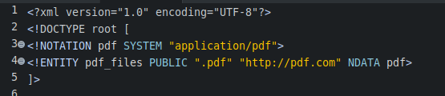
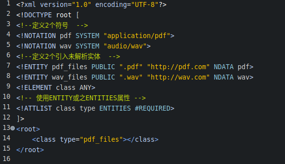
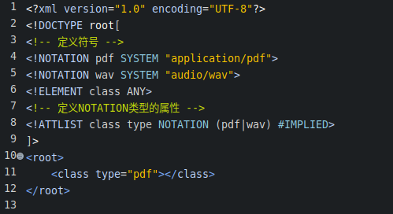

#### 什么是XML中的符号  
- 为什么规范符号  
  XML只是一个普通的文本文件,它无法处理更复杂的数据类型,比如图片,声音等.XML无法处理这些数据,而是通过定义符号来标记这些数据.  
- 符号标记的语法  
  普通符号  
  `<!NOTATION notation SYSTEM "value">`  
  公用符号  
  `<!NOTATION notation PUBLIC "name" "value" > `  
- 符号值的2种形式  
  (1) MIME类型  
  (2) 外部程序所在的路径  

#### 未解析实体  
- 外部文件的2个规范  
  (1) 是1个文本文件;  
  (2) 满足XML要求的文档结构规范;  
- 什么是未解析实体?  
  (1) 实体的分类中,有1种外部实体.  
  (2) 所谓的外部实体,就是专门保存实体值数据的外部文件.  
  (3) 如果外部文件无法满足前面所提的2个规范,这个外部文件保存的实体,就称为未解析实体.  
  (4) 对于未解析实体,XML解析器不会进行处理.  
- 定义未解析实体的语法  
  `<!ENTITY % 实体名 SYSTEM|PUBLIC ["公共实体标识"] "实体值所在文件的URI" NDATA notation>`  
  总结,只要在`<!ENTITY ...`定义后增加`NDATA`和符号名即可.  
- 引入未解析实体的语法  
  通过`ENTITY`或之`ENTITIES`属性类型来引用  
  `<!ATTLIST 所属元素 元素名 ENTITY|ENTITIES ["属性约束规则" ] ["默认值"]`  
- 引入未解析实体示例  
    

#### ENTITY和ENTITIES类型的属性  
- 什么是ENTITY和ENTITIES类型的属性?  
  (1) ENTITY和ENTITIES类型的属性,和定义其他普通类型的属性没有什么区别.  
  (2) 只是在XML文档中使用这些属性时,其值只能是未解析实体.  
- 简单但验证不通过的示例  
    
  以上示例,除了实体URI地址错误,其他的均符合规范.  
- 使用该属性的注意事项  
  (1) 一旦XML中的某元素的属性声明为ENTITY或之ENTITIES类型,它的值只能是未解析实体.  
  (2) 作为未解析实体,在XML中不能通过普通的方式引用,它们只能作为ENTITY或之ENTITIES类型属性的值.  

#### NOTATION类型的属性  
- 定义元素属性类型为NOTATION类型时的注意事项  
  (1) NOTATION类型属性的值只能是在DTD文档中定义的符号.  
  (2) 声明元素属性为NOTATION类型时,对于其属性值的定义,必须且只能使用枚举类型的方式罗列符号值.  
- 简单的使用案例  
    
