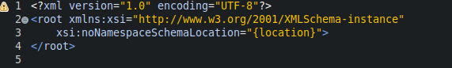
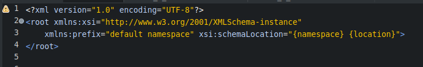

#### XSD的根元素  
- 什么是XSD?  
  XSD,标准称呼XML Schema.  
  是对DTD的补充和扩展,DTD能做的约束,XSD都能够做到;DTD做不到的约束,XSD也能做到.  
- 什么是XSD的根元素?  
  (1) XSD区别于DTD,使用方式只能使用外部文件引入的方式.  
  (2) XSD的文件和DTD,XML类似,首行都必须要进行声明.  
  (3) XSD的根元素,参考地址文件`http://www.w3.org/2001/XMLSchema`.其内声明的根元素`schema`就是XSD的根元素.  
- XSD根元素预置概览  
    
- 2种使用XSD根元素的方式  
  (1) 结合xml的匿名命名空间的特性,直接使用.  
  (2) 结合xml的带前缀的命名空间的特性,使用`prefix:schema`的方式使用.  

#### XSD根元素属性参考  
- `id`  
  全局的唯一标识ID.  
- `targetNamespace`  
  设置此XSD的命名空间的URI引用地址.  
- `attributeFromDefault`  
  使用此XSD约束的属性时,是否必须使用命名空间前缀.  
  候选值有2个,是`qualified`,`unqualified`  
- `elementFromDefault`  
  使用此XSD约束的元素时,是否必须使用命名空间前缀.  
  候选值有2个,是`qualified`,`unqualified`  
- `blockDefault`  
  设置XSD中element,complexType的block属性的默认值.  
- `finalDefault`  
  设置XSD中element,simpleType,complexType的final属性的默认值.  
- `version`  
  设置此XSD的版本号.  
- `xmlns`  
  声明此XSD引用的其他XSD的URI地址.  
- any attibutes  
  规定带有non-schema命名空间前缀的其他任何属性.  

#### XSD的使用方式  
- 在XML中引入无命名空间的XSD  
    
  (1) `xmlns:xsi`是固定的,并且其值也是固定的.  
  (2) `xsi:noNamespaceSchemaLocation`属性,表示引入的无命名空间的XSD,其值对应的是XSD的URI路径.  
  (3) `{location}`指的是XSD文件的URI,一般使用相对路径.  
- 在XML种引入带命名空间前缀的XSD  
    
  (1) `xmlns:xsi`属性及其值,固定不变.  
  (2) `xmlns:prefix` : 引入一个XSD约束,当引入多个XSD约束,就声明多个属性.  
  (3) `default namespace` : 指的是引入XSD的URI地址.  
  (4) `xsi:schemaLocation` : 标记XSD的URI地址和对应XSD的文件名称,注意文件名称需要全称.此属性只能声明一次,多个XSD用空格隔开.  
  (5) `namespace` : XSD的URI地址.  
  (6) `location` : XSD文件的全名称.  
