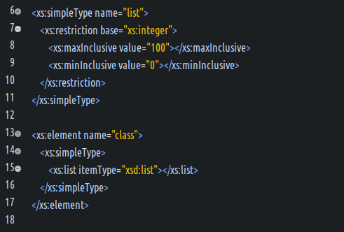
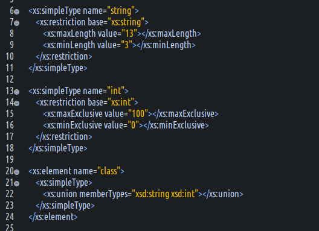

#### simpleType元素概览  
- 定义  
  定义一个简单类型,规定并约束纯文本的元素或之属性的值.  
- 支持的属性  
  (1) `id` : 可选的,标记元素的唯一ID.  
  (2) `name` : 必选,指定类型的名称.在同类型的元素中,name的值必须保证唯一性.  
  (3) `any attributes` : 可选,规定带有non-schema命名空间的任何其他属性.  
- 支持的子元素  
  `(annotation?,(restriction|list|union))`  
- 支持的父元素  
  `attribute`,`element`,`retriction`,`list`,`union`,`schema`  

#### 包含子元素简要说明  
- `<anntation .../>`
  用于该简单类型的简要文档注释.  
- `<restriction .../>`  
  对simpleType,simpleContent,complexContent的约束,不作嵌套simpleType元素时,其base属性是必选的.    
- `<list .../>`  
  定义类似ENTITIES,NMTOKENS列表的类型列表,其内多个元素之间用空格隔开.  
- `<union .../>`  
  定义一个集合,可以包含多个不同类型的simpleType.   

#### 详解restriction元素  
- 定义  
  主要对simpleType,simpleContent,complexContent进行限制约束.  
- 支持的属性  
  (1) `id` : 该元素在全局作用域中的唯一ID标识.  
  (2) `base` : 该元素作为限制约束,所依赖的XSD的内置类型.  
  (3) `any attributes` : 规定带有non-schema命名空间的其他任何属性.  
- 支持的父元素  
  `simpleType`,`simpleContent`,`complexContent`  
- 支持的子元素  
  (1) 当限制simpleType元素时  
  ```xml
  (annotation?,(simpleType?,(minExclusive|minInclusive|
  maxExclusive|maxInclusive|totalDigits|fractionDigits|
  length|minLength|maxLength|enumeration|whiteSpace|pattern)*))
  ```  
  (2) 当限制simpleContent元素时  
  ```xml
  (annotation?,(simpleType?,(minExclusive |minInclusive|
  maxExclusive|maxInclusive|totalDigits|fractionDigits|
  length|minLength|maxLength|enumeration|whiteSpace|pattern)*)?,
  ((attribute|attributeGroup)*,anyAttribute?))
  ```  
  (3) 当限制complexContent元素时  
  ```xml
  (annotation?,(group|all|choice|sequence)?,
  ((attribute|attributeGroup)*,anyAttribute?))
  ```  
- 关于restriction部分支持属性的额外说明  
  (1) annotation是文档注释元素,此处不赘述.  
  (2) 语法规则上是支持simpleType嵌套simpleType的,但实属多次一举,如无特殊情况,个人一般不推荐restriction内嵌套simpleType元素.  
- 关于此元素的示例,不赘述,查看其他相关笔记.  

#### 详解list元素  
- 定义  
  list元素用来定义单个simpleType定义的集合.  
  可参考理解DTD内置属性类型中的IDREFS,ENTITIES,NMTOKENS类型.  
- 支持的属性  
  (1) `id` : 全局下的唯一标识ID.  
  (2) `itemType` : XSD内置类型或之simpleType新建的派生类型;注意,此属性和内嵌子元素simpleType是互斥的.  
  (3) `any attributes` : 规定带有non-schema命名空间的其他任何属性.  
- 支持的父元素  
  simpleType  
- 支持的子元素  
  `(annotation?,(simpleType?))`  
- 关于使用list元素的注意事项  
  (1) 因为列表以空格作为分割符号,不推荐对string,normailizedString,token等字符串类型约束为list类型,因为字符串数据本身就可能包含空格.  
  (2) 内建的12种facet对list元素不是全部支持的,以下罗列的是支持的内建约束.  
  长度约束 : `length`,`maxLength`,`minLength`  
  枚举约束 : `enumeration`  
  正则约束 : `pattern`  
  空白约束 : `whiteSpace`  
  对于以上约束有以下几点补充说明  
  a) 长度约束,约束的是列表的个数,即列表元素内的个数;  
  b) 空白约束的值,只能是`collapse`;  
  c) 正则和枚举约束,约束的是列表的整体,而不是列表元素个体;  
- `<list .../>`示例  
    

#### 详解union元素  
- 定义  
  union元素用来定义多个simpleType定义的集合.  
  与list的本质区别,list只支持单一类型的组装,而union支持多种类型数据的组装.  
- 支持的属性  
  (1) `id` : 全局下的唯一标识ID.  
  (2) `memberType` : 多个simpleType的name属性值,多个之间用空格隔开.注意,此属性与内嵌的子元素simpleType是互斥的.  
  (3) `any attributes` : 规定带有non-schema命名空间的其他任何属性.  
- 支持的父元素  
  simpleType  
- 支持的子元素  
  `(annotation?,(simpleType*))`  
- 关于union元素的补充说明  
  (1) 内建的facet约束,对union仅有部分支持.  
  以下列出的是支持union约束限制的facet  
  枚举约束 : `enumeration`  
  正则约束 : `pattern`  
- `<union .../>`示例  
    

#### 关于list和union的组合说明  
- XSD支持list和union的组合使用.  
- 允许list内嵌套union,也允许union内嵌套list.  
- 但是不允许list内嵌套list,union内嵌套union.  
- 此功能使用用于设计约束复杂结构的XML文档,一般很少使用.  
