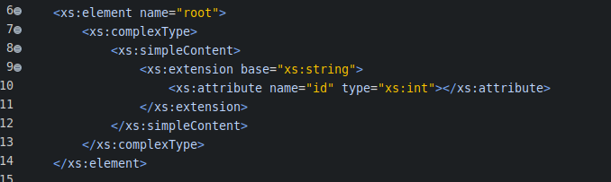
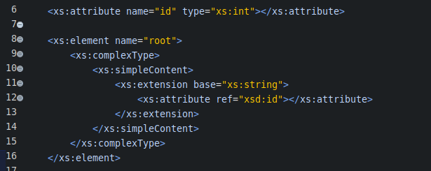
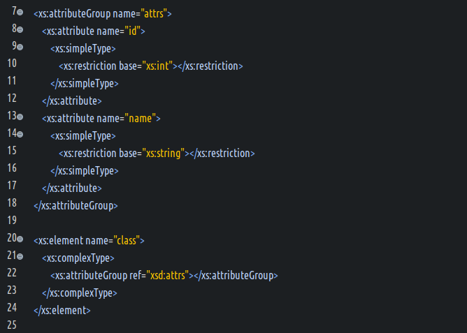

#### attribute元素详解  
- 定义  
  在XSD中使用该元素定义一个属性.  
  可嵌套作为局部匿名属性,也可以作为全局命名属性.  
- 支持的属性  
  (1) `id` : 全局下的唯一标识ID.  
  (2) `name` : 标记该属性的名称,不可和ref属性同时出现.  
  (3) `ref` : 标记对其他属性的引用.不可和name,form,type属性同时出现,也不可和simpleType子元素同时出现.  
  (4) `form` : 规定此属性是否必须通过命名空间前缀来使用.候选值是qualified和unqualified.  
  (5) `type` : 指定此属性的类型是XSD内建的简单类型,或之是simpleType派生的简单类型.该属性不能和simpleType子元素同时出现.  
  (6) `default` : 设置此属性的默认值.  
  (7) `fixed` : 设置此属性的固定值.  
  (8) `use` : 设置该属性的使用方式.候选值是optional,prohibited,required.  
  (9) `any attributes` : 规定带有non-schema的命名空间的其他任何属性  
- 支持的父元素  
  `attributeGroup`,`schema`,`complexType`,`restriction(simpleContent)`,`extension(simpleContent)`,`restriction(complexContent)`,`extension(complexContent)`  
- 支持的子元素  
  `(annotation?,(simpleType?))`  
- 关于use属性的补充说明  
  候选值`prohibited`的使用场景  
  (1) 已有复杂类型派生新的复杂类型,用于删除原复杂类型的某个属性.  
  (2) 对某个属性指定了default属性值的时候.  
- 使用示例  
  定义局部匿名的属性  
    
  定义全局命名的属性  
    

#### attributeGroup元素详解  
- 定义  
  此元素用来定义一个属性组,用以插入到复杂类型的属性约束中.  
- 支持的属性  
  (1) `id` :全局下唯一标识的ID.  
  (2) `name` : 此元素标记的名称.  
  (3) `ref` : 对指定属性组的引用,此属性不能和name属性同时出现.  
  (4) `any attributes` : 规定带有non-schema命名空间的其他任何属性.  
- 支持的父元素  
  `attributeGroup`,`complexType`,`schema`,`restriction(simpleContent)`,`entension(simpleContent)`,`restriction(complexContent)`,`extension(complexContent)`  
- 支持的子元素  
  `(annotation?),((attribute|attributeGroup)*,anyAttribute?))`  
- 使用示例  
    

#### anyAttribute元素详解  
- 定义  
  定义指定的元素,可以使用XSD规定之外的属性,进行编写XML文档.  
- 支持的属性  
  (1) `id` : 全局下的唯一标识ID.  
  (2) `namespace` : 规定包含可以使用元素的命名空间,可选.  
  (3) `processContents` : 一个指示符,可选.  
  (4) `any attributes` : 规定带有non-schema命名空间的其他任何属性.  
- 支持的父元素  
  `complexType`,`restriction(both simpleContent and complexContent)`,`extension(both simpleContent and complexContent)`,`attributeGroup`  
- 支持的子元素  
  `(annotation?)`  
- 使用示例  
  真实环境测试下,并且使用了JAVA进行验证,发现此元素不生效.  
  问题后续待定.暂不使用该元素.  
