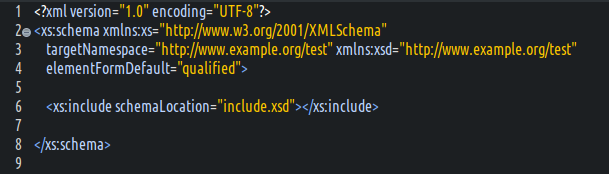
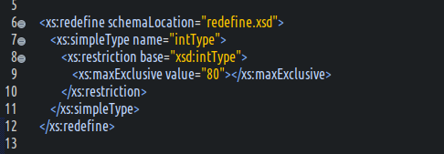
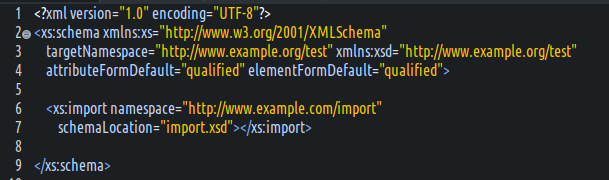

#### 合并提要  
- XSD允许将不同模块的XML组件定义在不同的XSD中.  
- XSD支持将多个XSD文件合并到一个XSD中,并且提供了3种方式.  

#### 使用include元素  
- 使用`<include .../>`元素的注意事项  
  (1) include元素必须作为schema的子元素;  
  (2) inlcude元素必须放置在schema元素内的开头部分;  
  (3) 只有annotation,import,redefine元素可以放置在include元素的前面;  
  (4) 使用inlcude合并的XSD,要么没有目标命名空间,要么与当前XSD的目标命名空间相同.  
  这意味着,被合并的XSD将会被删除它本身的命名空间.  
- include元素支持的属性  
  (1) `id` : 全局下的唯一标识ID,一般很少使用.  
  (2) `schemaLocation` : 表明要合并的XSD文件的位置URI.  
- 使用示例  
    
  补充说明  
  a) 当前两个文件在同级目录中.  
  b) `include.xsd`文件设置了`targetNamespace`属性,故该值在示例文件中会被删除,其内规定的元素和属性的命名空间,以该文件规定的为准.  

#### 使用redefine元素  
- 使用`<redefine .../>`元素的注意事项  
  和include元素相同.  
- redefine支持的属性  
  和include元素相同.  
- redefine和include元素的区别  
  允许重新定义被合并的XSD中的schema组件.  
- 重定义导入schema组件的注意事项  
  (1) 重定义的schema组件,必须是被导入的XSD中存在的.  
  (2) 只能对schema组件进行增加限制,或之增加扩展.  
  (3) 若对schema组件增加限制,则不能违反原有XSD中的限制逻辑.  
  简言之,就是只能缩小限制的范围.  
- 使用示例  
    

#### 使用import元素  
- 使用`<import .../>`元素的注意事项  
  (1) import元素必须作为schema的子元素;  
  (2) import元素必须放在schema子元素的首行;  
  (3) 只有annotation,include,redefine元素能放置在其前面;  
  (4) 被导入的XSD和导入的XSD的命名空间不能相同!  
  a. 被导入的XSD可以没有命名空间;  
  b. 被导入的XSD若有命名空间,和导入的XSD不能相同;  
  c. 2个XSD不能同时没有命名空间.  
- import元素支持的属性  
  (1) `id` : 全局下的唯一ID;  
  (2) `schemaLocation` : 需要导入的XSD文档的URI位置;  
  (3) `namespace` : 导入的XSD的目标命名空间;  
- 使用示例  
    
