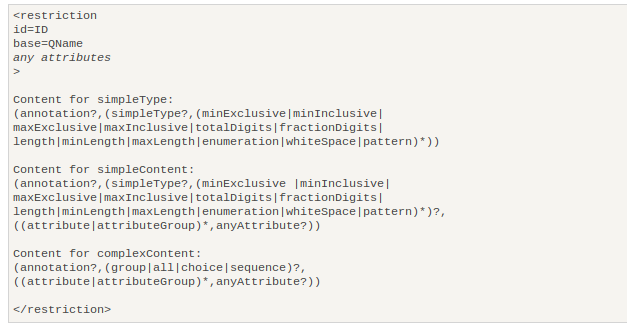

  


指定基类型的方式  
```xml
	<xs:simpleType name="intType">
		<xs:restriction base="xs:int">
			<xs:minExclusive value="0"></xs:minExclusive>
			<xs:maxExclusive value="100"></xs:maxExclusive>
		</xs:restriction>
	</xs:simpleType>
```
