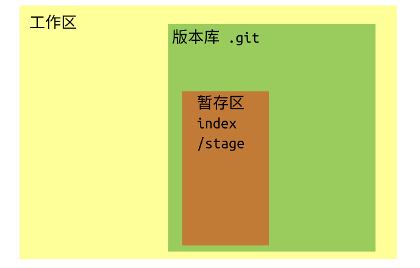
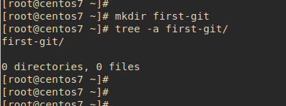
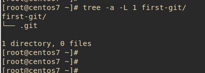
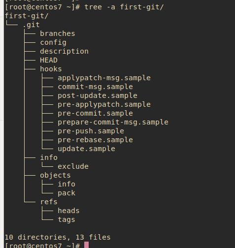
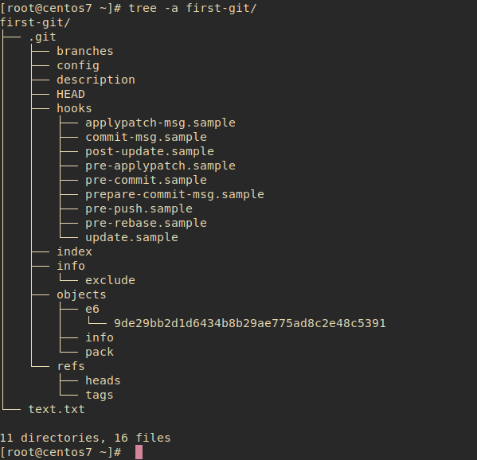
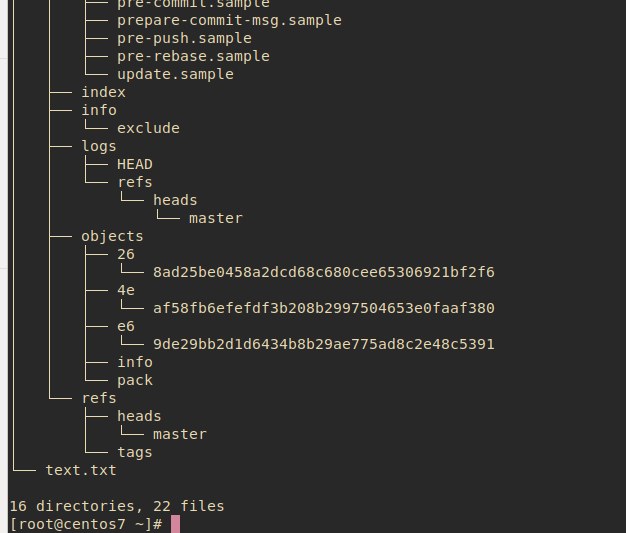

#### 命名方式

工作区 : `work-directory`  
版本库 : `.git`  
暂存区 : `index`  
三者之间存在明显的包含关系,即工作区>版本库>暂存区.  
以下是简单的示意图 :  

#### 工作区

通常情况,要使用 git 进行管理的文件夹,用 git 术语讲就是一个工作区.只不过这个工作区,没有被 git 管理工具进行初始化,只有进行初始化之后,git 才会在用户所选定的工作区内创建一个对应的版本库.  
以下是没有被初始化的工作区目录结构图 :  
  
以下是初始化后的工作区的目录结构图 :  
调用`git init`指令后,就会在空的工作区内生成一个版本库文件夹,名称为`.git`.

#### 版本库(.git)

`.git`文件夹就是管理工作区的 git 版本库,通常在创建一个空的工作区的时候,一般都是首先执行此命令的.  
以下是初始化后没有做任何操作的版本库示意图 :  

#### 暂存区(index)

在讲暂存区之前,需要学习两个指令.一个是`git add <file-name>`,另一个是`git commit -m <commit-message>`;前者的任务是将工作区的修改提交到暂存区`index`,后者的任务是将暂存区的修改提交到分支`branch`上.  
基于当前最新版的 git,以及不同的测试平台(window 和 linux)上,git 的暂存区命名采用的是`index`,不过有些参考书上提及到有些平台会将暂存区命名为`stage`.(此点仅做常识补充)  
以下截图是调用`git add ./`指令后的版本库的示意图 :  
可以看到此截图中,多出了 index 文件,此文件表示的就是暂存区.  
  
以下是调用`git commit -m 'commit files'`指令后的版本库示意图 :  
可以看到此截图中,又多出了`master`文件在`heads`的分支下.在版本库的文件中,`heads`表示的是分支管理的文件,`tags`表示的是标签管理的文件.另外又多出的`logs`文件是版本库中常用的功能支持,即版本回退.此处重点讲的是`master`分支.在用户没有对分支进行特殊操作的时候,git 会默认为当前的版本库创建一个默认的分支,即`master`.结合开头所说的,可总结`git init`将修改存储到 `index` 中,`git commit`将修改存储到对应的`heads`中.  

