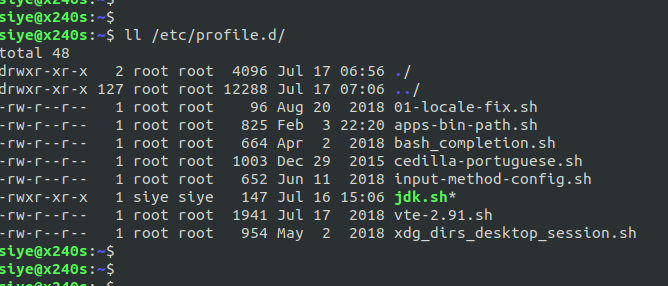
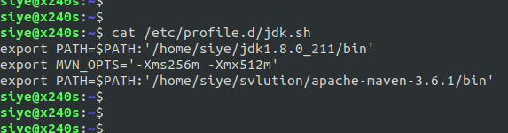
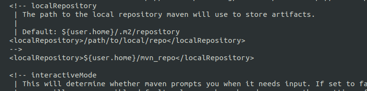
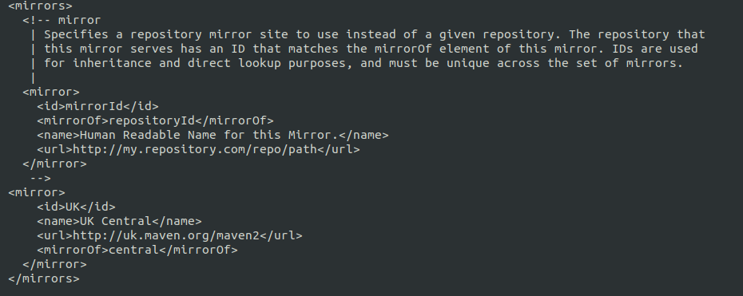
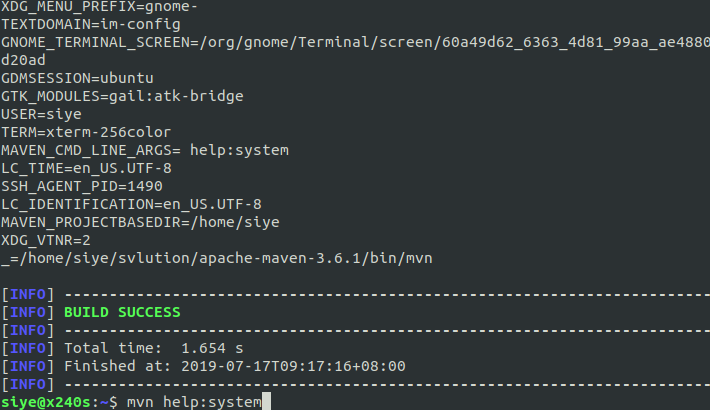

- 安装及变量的配置  
  1)安装必要的jdk和maven,注意版本兼容问题.  
  2)在系统配置目录下,新建任意名的`sh`文件.  
    
  3)配置环境变量  
    
  4)对该脚本分配必要的用户所属权限.  
- 配置文件必要修改  
  1)指定本地仓库的目录  
    
  2)配置使用中央镜像地址  
    
  3)指定jdk版本  
    
  4)执行mvn初始化推荐的指令  
  `mvn help:system`,该指令会下载必要的mvn插件.  
    
