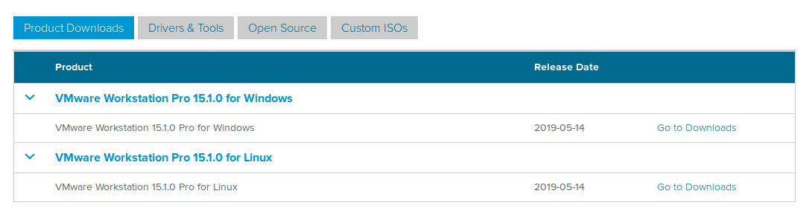
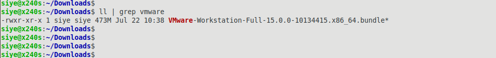

- 现今要从vmware官方下载正版的软件,需要注册一个账号.  
- 在搜索引擎中输入关键字`vmware download`,然后找到官网的下载链接直接进入.  
  选择linux版本的然后点击下载.当前下载的版本是`vmware15.0.0`版本的.  
    
- 给下载的文件赋予执行权限,然后直接运行,使用`./`  
    
- 若当前系统中没有安装gcc,在安装的过程中会提示安装gcc,按照提示进行安装或之手动安装需求版本的gcc.  
