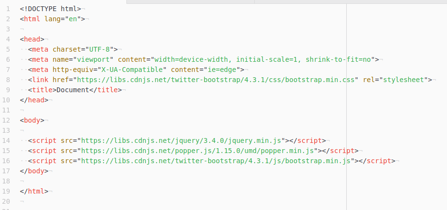

> 资源文件引用的最低标准

- `bootstrap.min.css`
- `jquery.min.js`
- `popper.js`
- `bootstrap.min.js`

(1)  
以上列出的也是资源文件引用的顺序,无论引用本地的文件,还是引用在线的 CDN,都应当遵循这个顺序.一般情况下,推荐在`head`元素内放置 css 文件,在`</body>`元素之前引用 js 文件,注意!jquery 必须放在首位,然后是 popper,最后才是 bootstrap4 的 js 文件.  
(2)  
为保证 bootstrap4 的渲染效果正常,应当在文件头部声明`HTML5`的文档标记 :

```html
<!DOCTYPE html>
<html lang="en">
  ...
</html>
```

(3)  
若要设计的页面是移动设备优先的响应式布局,应当添加以下的`meta`元素.  
`<meta name="viewport" content="width=device-width, initial-scale=1, shrink-to-fit=no">`  
(4)  
国内推荐的 cdn 地址 : `https://cdnjs.net/`

以下是实际使用的布局截图 :  

