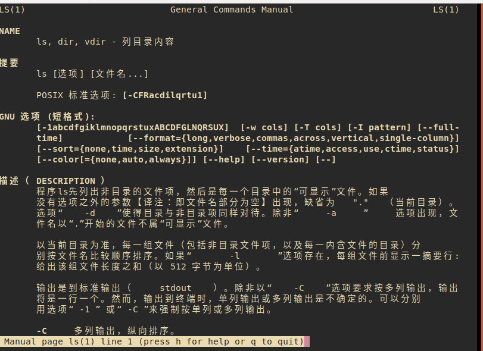

> 下载使用汉化版的 man 指令本地文档

```
[root@centos7 ~]#
[root@centos7 ~]# yum list | grep -i man-pages-zh-cn
man-pages-zh-CN.noarch                  1.5.2-4.el7                    @base
[root@centos7 ~]# find / | grep -i man/zh_cn | head -9
/var/cache/man/zh_CN
/var/cache/man/zh_CN/cat1
/var/cache/man/zh_CN/cat1/chmod.1.gz
/var/cache/man/zh_CN/cat3
/var/cache/man/zh_CN/cat5
/var/cache/man/zh_CN/cat8
/var/cache/man/zh_CN/index.db
/var/cache/man/zh_CN/CACHEDIR.TAG
/usr/share/man/zh_CN
[root@centos7 ~]# find / -maxdepth 4 | grep -i man/zh_cn
/var/cache/man/zh_CN
/usr/share/man/zh_CN
[root@centos7 ~]# man --help | grep '\-M'
  -M, --manpath=PATH         set search path for manual pages to PATH
[root@centos7 ~]# cat .bashrc | grep cman
alias cman='man -M /usr/share/man/zh_CN'
[root@centos7 ~]#
```

centos7 的效果图如下 :  

