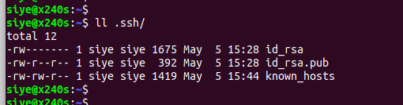
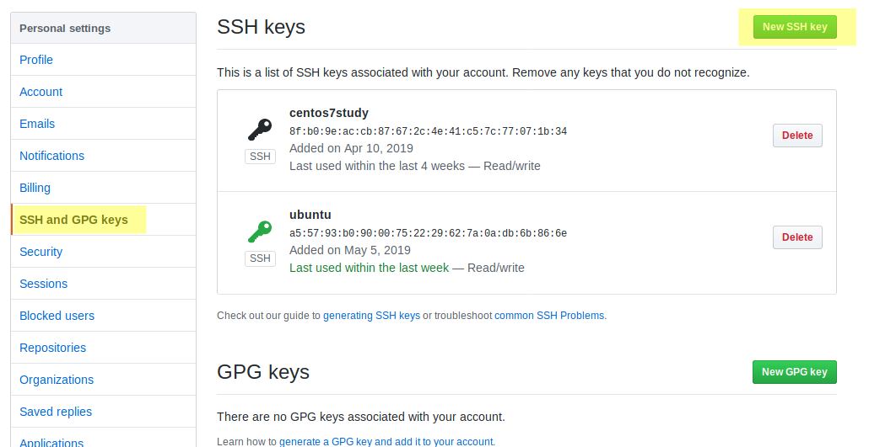
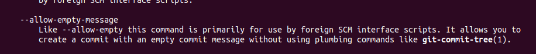
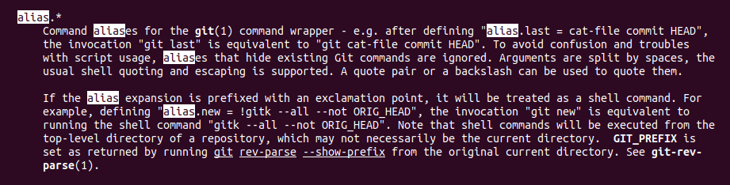
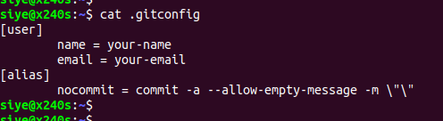

#### 配置用户信息

`git conifg --global user.name 'your-name'` : 配置用户姓名  
`git conifg --global user.email 'your-email'` : 配置用户的邮箱地址

#### 配置 ssh 密匙

使用指令`ssh-keygen`即可,选项`-t`表示加密的算法选项,一般选择`rsa`.如`ssh-keygen -t rsa`.大部分参考书推荐加上`-C`选项,个人使用一般不加,根据个人习惯.`-C`选项说明如下(无非是备注说明) :  

此指令会在用户的目录下生成一个隐藏文件`.ssh`,里面会生成两个密匙文件,一个是公用的,一个是私用的.注意,在 github 上添加 ssh 密匙的时候,一定要添加公用的.如下 :  

github 上添加密匙的方法,在用户设置选项中,选择`ssh and gpg keys`选项即可,然后点击添加按钮,将密匙文本拷贝保存.如下 :  

#### 配置提交习惯

git 的提交指令`git commit`是强制要求附带有提交备注的,即附带选项`-m <message>`.但是涉及频繁操作,或者是个人的备份时,有时候是不需要这个配置的.这种限制的好处是便捷的记录了用户的所有提交历史,并且辅助用户查看对应提交阶段的提交内容补充的.

但是,这总限制会大大降低涉及频繁提交的操作时间的.而且个人仓库中有时候是不需要这些配置的,可以使用`git commit`中的选项进行取消,并结合`git config`的别名选项来简单操作.

关于`git commit`中的选项`--allow-empty-message`的文档说明如下 :  

关于`git config`中的选项`alias.*`的文档说明如下 :  

故使用`git config --global alias.nocommit 'commit -a --allow-empty-message -m ""'`指令,即可配置空提交备注的提交别名选项了.上面的配置信息,使用`git nocommit`即可提交信息,且省略了选项`-m`的强制限制.

补充 :  
通过查看 global 级别的全局配置文件可查看所有的配置信息.(此文件在`~./gitconfig`)  

