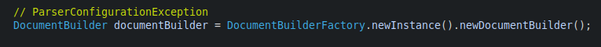

ErrorHandler接口规范  
- `org.xml.sax.ErrorHandler.warning(SAXParseException)`,解析XML文档出现警告时触发.  
- `org.xml.sax.ErrorHandler.error(SAXParseException)`,解析XML文档出现可恢复的错误时触发.  
- `org.xml.sax.ErrorHandler.fatalError(SAXParseException)`,解析XML文档出现不可恢复的错误时触发.  

DOM树中的对象类型  
- `org.w3c.dom.Node`,代表DOM中所有的节点元素.  
- `org.w3c.dom.Document`,代表XML文档中的根元素.  
- `org.w3c.dom.DocumentType`,代表XML文档中的DocType声明.  
- `org.w3c.dom.DocumentFragment`,代表XML文档中的某个文档片段.  
- `org.w3c.dom.Element`,代表XML文档中的元素.  
- `org.w3c.dom.Attr`,代表XML文档中的属性.  
- `org.w3c.dom.CharacterData`,代表XML中的各种字符数据.  
- `org.w3c.dom.Text`,代表XML中的文本数据.  
- `org.w3c.dom.Comment`,代表XML文档注释中的字符数据.  
- `org.w3c.dom.CDATASection`,代表XML中的CDATA字段.  
- `org.w3c.dom.Entity`,代表XML文档中的实体.  
- `org.w3c.dom.EntityReference`,代表XML中的实体引用.  
- `org.w3c.dom.ProcessingInstruction`,代表XML中的处理指令.  
- `org.w3c.dom.Notation`,代表XML中声明的符号.  

DOM的解析器  
- `javax.xml.parsers.DocumentBuilder`  
- `javax.xml.parsers.DocumentBuilderFactory`  

  

DocumentBuilderFactory常用方法  
- `javax.xml.parsers.DocumentBuilderFactory.newInstance()`,获取DocumentBuilderFactory的实例.  
- `javax.xml.parsers.DocumentBuilderFactory.newDocumentBuilder()`,获取DocumentBuilder的实例.  
- `javax.xml.parsers.DocumentBuilderFactory.setNamespaceAware(boolean)`,创建DOM解析器时,是否支持XML的命名空间,默认false.  
- `javax.xml.parsers.DocumentBuilderFactory.setValidating(boolean)`,创建DOM解析器前,是否进行DTD验证,默认false.  
- `javax.xml.parsers.DocumentBuilderFactory.setIgnoringElementContentWhitespace(boolean)`,创建DOM解析器时,是否自动删除节点元素内的空格,默认false.  
- `javax.xml.parsers.DocumentBuilderFactory.setExpandEntityReferences(boolean)`,创建DOM解析器时,是否获取外部实体引用的数据,默认true.  
- `javax.xml.parsers.DocumentBuilderFactory.setIgnoringComments(boolean)`,创建DOM解析器时,是否自动忽略XML中的文档注释,默认false.  
- `javax.xml.parsers.DocumentBuilderFactory.setCoalescing(boolean)`,创建DOM解析器时,是否将CDATA字段转换为Text节点,并将其添加到相邻的(如果有)Text节点,默认false.
- `javax.xml.parsers.DocumentBuilderFactory.setSchema(Schema)`,创建DOM解析器时,指定Schema来验证XML的有效性.  
- `javax.xml.parsers.DocumentBuilderFactory.setXIncludeAware(boolean)`  
- `javax.xml.parsers.DocumentBuilderFactory.setAttribute(String, Object)`  
- `javax.xml.parsers.DocumentBuilderFactory.setFeature(String, boolean)`  

---

Document常用方法  
- `org.w3c.dom.Document.getDocumentElement()`,获取XML的根节点.  
- `org.w3c.dom.Document.getElementById(String)`,根据XML的ID来获取XML元素.  
- `org.w3c.dom.Document.getElementsByTagName(String)`,根据XML的标签名称来获取XML元素.  

Node常用方法  
- `org.w3c.dom.Node.getAttributes()`,返回当前节点包含的所有属性集.  
- `org.w3c.dom.Node.getChildNodes()`,返回当前节点所包含的所有子节点.  
- `org.w3c.dom.Node.getFirstChild()`,返回当前节点所包含的第1个子节点.  
- `org.w3c.dom.Node.getLastChild()`,返回当前节点所包含的最后1个子节点.  
- `org.w3c.dom.Node.getParentNode()`,返回当前节点的上1级(父级)节点.  
- `org.w3c.dom.Node.getNextSibling()`,返回当前节点的下1个同级别(兄弟)节点.  
- `org.w3c.dom.Node.getPreviousSibling()`,返回当前节点的上1个同级别(兄弟)节点.  
- `org.w3c.dom.Node.getNodeName()`,返回当前节点的名称.  
- `org.w3c.dom.Node.getNodeValue()`,返回当前节点的值.(注意不是节点文本)  
- `org.w3c.dom.Node.getTextContent()`,返回当前节点及其后代的文本内容.  
- `org.w3c.dom.Node.getNodeType()`,返回当前节点的类型.(参考Node的内置常量)
- `org.w3c.dom.Node.getLocalName()`,返回当前节点标签名的本地部分.(就是标签名中冒号后面的部分)  
- `org.w3c.dom.Node.getNamespaceURI()`,返回当前节点标签内命名空间对应的URI.  
- `org.w3c.dom.Node.getPrefix()`,返回当前节点标签内命名空间的前缀.  
- `org.w3c.dom.Node.getOwnerDocument()`,返回当前节点所在的Document对象.  
- `org.w3c.dom.Node.hasAttributes()`,判断当前节点是否包含属性.  
- `org.w3c.dom.Node.hasChildNodes()`,判断当前节点是否包含子节点.  

Element常用方法  
- `org.w3c.dom.Element.getAttribute(String)`,根据属性名称获取当前节点的指定属性值.  
- `org.w3c.dom.Element.getAttributeNode(String)`,根据属性名获取指定的属性节点.  
- `org.w3c.dom.Element.getElementsByTagName(String)`,根据标签名,返回该节点元素包含的所有后代元素的节点集合.  
- `org.w3c.dom.Element.getTagName()`,获取当前元素的标签名称.  
- `org.w3c.dom.Element.hasAttribute(String)`,判断当前元素是否包含指定名称的属性.  

NodeList常用方法  
- `org.w3c.dom.NodeList.item(int)`,返回指定索引的节点.  
- `org.w3c.dom.NodeList.getLength()`,返回节点集合的长度.(注意包含各种节点类型)

NamedNodeMap常用方法  
- `org.w3c.dom.NamedNodeMap.item(int)`,返回指定索引的属性节点.  
- `org.w3c.dom.NamedNodeMap.getLength()`,返回属性节点集合的长度.  

读取实例

```java
int index = 0;
Map<Integer, Map<String, String>> getElementMap = new HashMap<>();
Map<String, String> elementMap = null;
Map<Integer, Map<String, String>> getAttributeMap = new HashMap<>();
Map<String, String> attributeMap = null;

// ParserConfigurationException
DocumentBuilder documentBuilder = DocumentBuilderFactory.newInstance().newDocumentBuilder();
// SAXException, IOException
Document document = documentBuilder.parse(new File("ReadXml.xml"));
Element rootElement = document.getDocumentElement();
String rootTagName = rootElement.getTagName();
System.out.println(rootTagName);

if (rootElement.hasChildNodes()) {
	NodeList studentNodeList = rootElement.getChildNodes();
	// size
	for (int i = 0; i < studentNodeList.getLength(); i++) {
		Node studentNode = studentNodeList.item(i);
		if (studentNode.getNodeType() == Node.ELEMENT_NODE) {
			// 此时才开开始遍历
			if (studentNode.hasAttributes()) {
				NamedNodeMap namedNodeMap = studentNode.getAttributes();
				attributeMap = new HashMap<>();
				for (int j = 0; j < namedNodeMap.getLength(); j++) {
					Node node = namedNodeMap.item(j);
					if (node.getNodeType() == Node.ATTRIBUTE_NODE) {
						attributeMap.put(node.getNodeName(), node.getNodeValue());
					}
				}
				getAttributeMap.put(index, attributeMap);
			}
			if (studentNode.hasChildNodes()) {
				NodeList nodeList = studentNode.getChildNodes();
				elementMap = new HashMap<>();
				for (int j = 0; j < nodeList.getLength(); j++) {
					Node node = nodeList.item(j);
					if (node.getNodeType() == Node.ELEMENT_NODE) {
						elementMap.put(node.getNodeName(), node.getTextContent());
					}
				}
				getElementMap.put(index, elementMap);
			}
			index++;
		}
	}
}
System.out.println(getAttributeMap);
System.out.println(getElementMap);
```
