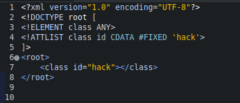
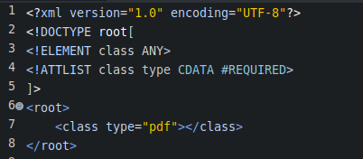
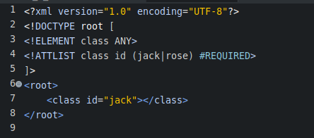
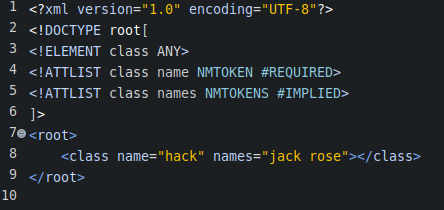

#### 语法规范  
&#8195;`<!ATTLIST 所属元素 属性名 属性类型 [元素对属性约束] [默认值]>`  
&#8195;(1) `元素对属性约束`和`默认值`是可选的;  
&#8195;(2) 当前者设置为`#REQUIRED`,`#IMPLIED`时,后者不能设定;  
&#8195;(3) 当前者设置为`FIXED`,后者必须设定;  

#### 属性约束的3种规则  
- #REQUIRED  
  该属性是必须的,必须对该属性提供值.  
- #IMPLIED  
  该属性是可选的.  
- #FIXED  
  该属性的值是固定的,必须指定默认值.  

#### 属性类型的分类  
1. `CDATA`  
   该属性只能是字符串数据.  
1. `(枚举1 | 枚举2 | 枚举3)`  
   该属性的值是枚举值之一.  
1. `ID`  
   该属性值必须是合法的标识符,且在xml中保证唯一性.  
1. `IDREF`  
   该属性值引用已存在的ID属性值.  
1. `IDREFS`  
   该属性值引用多个已存在的属性值,多个属性值之间用空格隔开.  
1. `NMTOKEN`  
   该属性,必须是个合法的XML标识符,约束力强于CDATA属性.  
1. `NMTOKENS`  
   该属性是多个NMTOKEN,多个属性值之间用空格隔开.  
1. `ENTITY`  
   该属性引用一个外部实体,比如图片.  
1. `ENTITIES`  
   该属性引用多个外部,多个实体之间用空格隔开.  
1. `NATATION`  
   该属性值是DTD中声明过的符号.(过期,不推荐)  
1. `xml:`  
   一个预定义的xml值.  

#### 简单示例  
- 属性规则约束示例  
    
- CDATA类型属性示例  
    
- 枚举类型属性示例  
    
- ID,IDREF,IDREFS类型属性示例  
    
- NMTOKEN或之NMTOKENS类型属性示例  
    
- ENTITY,ENTITIES和NOTATION类型的属性,参考符号笔记说明  
- `xml:`类型属性,待定  
