- XSD文件的作用,详细参考XML中的相关笔记.  
  - 校验配置spring的xml文件的合法性.  
  - 在IDE工具编辑的时候给出自动提示,协助开发.  
- 测试环境,以springweb项目为例.  
  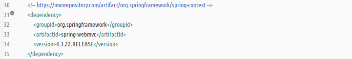  
- 各个模块中XSD文件的位置  
  - __spring-context__ 模块中总计有4个XSD文件.在org.springframework.context.config子包中有 _spring-context.xsd_ 文件;在org.springframework.cache.config子包中有 _spring-cache.xsd_ 文件;在org.springframework.ejb.config子包中有 _spring-jee.xsd_ 文件;在org.springframework.scripting.config子包中有 _spring-lang.xsd_ 文件;  
    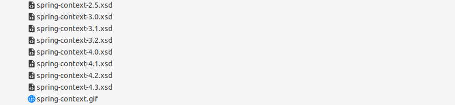  
    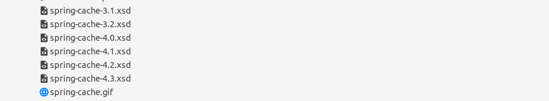  
    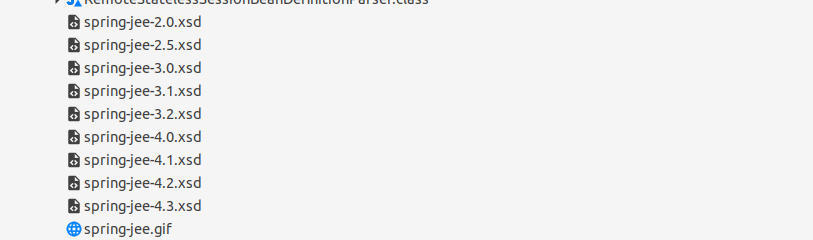  
    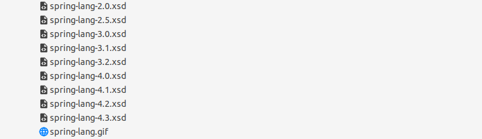  
  - __spring-bean__ 模块中总计有3个XSD文件.在org.springframework.beans.factory.xml子包中有 _spring-beans.xsd_ , _spring-tool.xsd_ , _spring-util.xsd_ 文件.  
    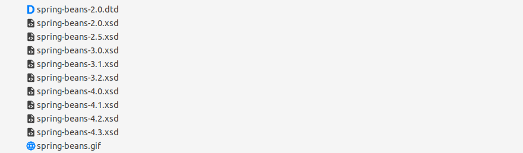  
    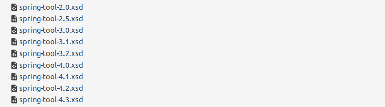  
    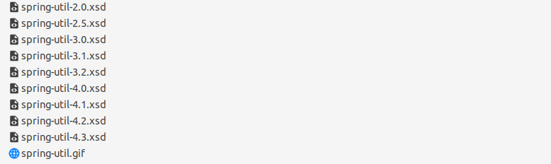  
  - __spring-aop__ 模块中的org.springframework.aop.config子包中有 _spring-aop.xsd_ 文件.  
    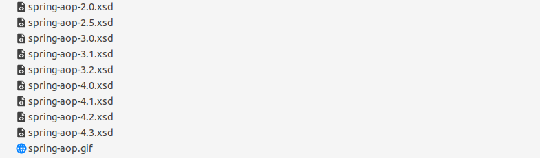  
  - __spring-webmvc__ 模块中的org.springframework.web.servlet.conifg子包中有 _spring-mvc.xsd_ 文件.  
    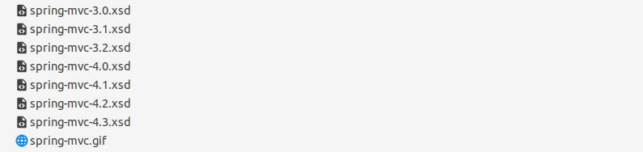  
  - __spring-core__ 和 __spring-web__ 模块中都没有XSD文件.  
- XSD文件的定位,也应参考模块之间的依赖关系.以下是mvn之间的依赖关系.  
  - __spring-webmvc__ 模块的依赖关系.  
    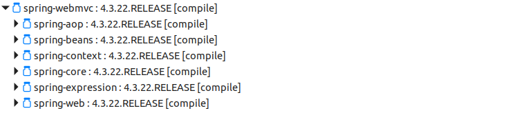  
  - __spring-context__ 模块的依赖关系.  
    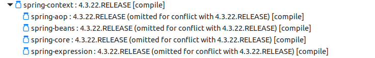  
  - 新版本的 __spring-core__ 才会自动导入依赖的日志框.  
      
