#### 提要  
1. 默认的springmvc容器环境下处理json的组件  
   _参考webmvc配置类中关于http信息转换组件设置的方法_  
   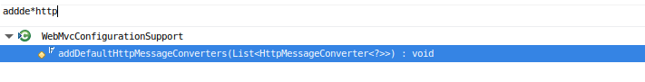  
   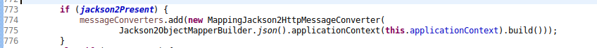  
   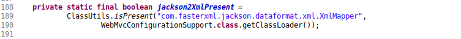  
1. 手动配置http信息转换组件的话,默认的配置会失效,因此建议配置必要的默认组件.  
   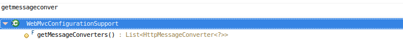  
   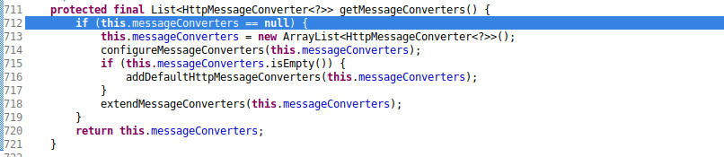  
1. 需要导入fastjson的资源包,注意版本,高版本的会报错(此处使用低版本),具体原因待定.  
   ```
   java.lang.IllegalArgumentException: 'Content-Type' cannot contain wildcard type '*'
   ```  
   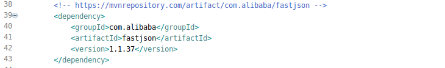  

#### 使用  
1. _真实环境容器的配置java-config_  
     
     
   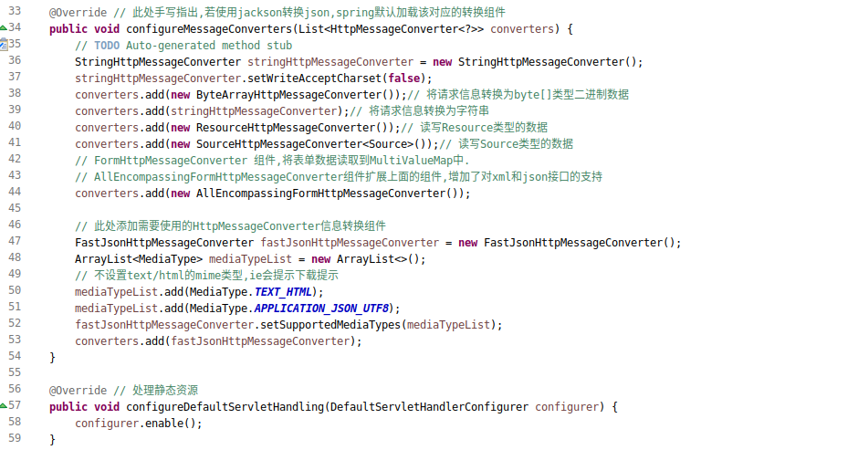  
1. _控制器配置_  
   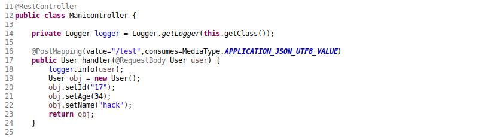  
1. _ajax配置_  
   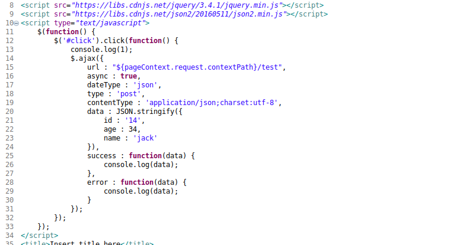  
1. _输出信息省略_  

#### 模拟  
1. _xml-config配置_  
   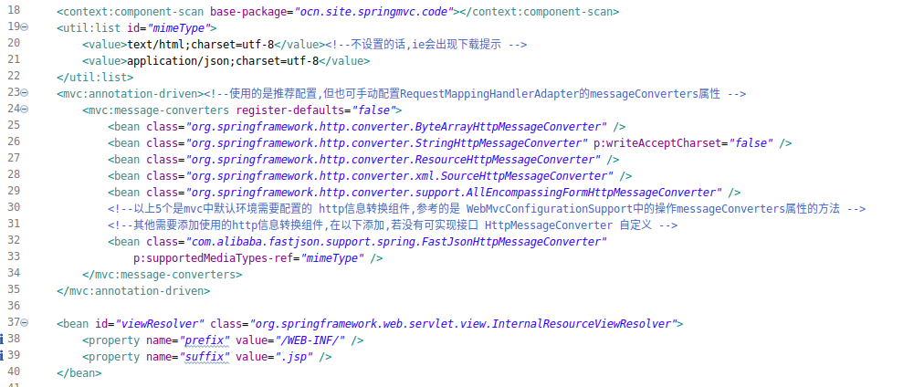  
1. _控制器配置省略_  
1. _模拟配置_  
   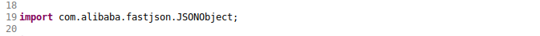  
   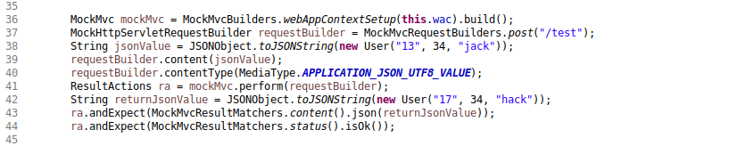  
1. _输出信息_  
   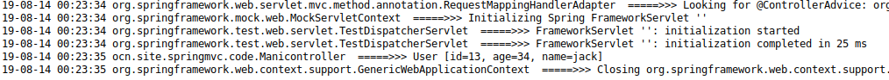  

#### 补充  
1. 另一种http信息转换的配置方式  
1. 配置此方法,可注册默认的http信息转换组件  
   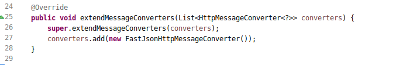  
   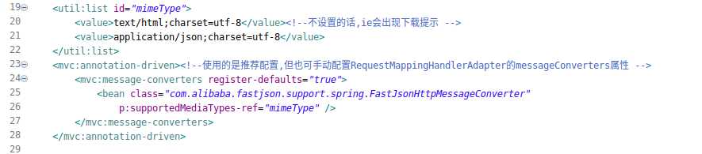  
