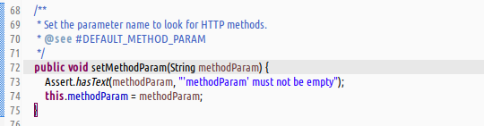
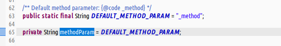
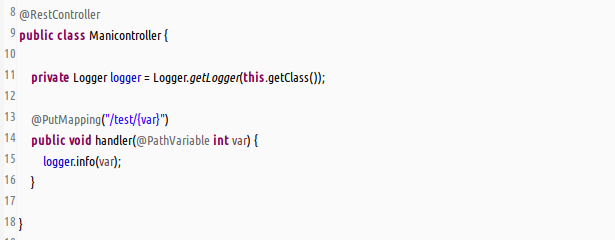
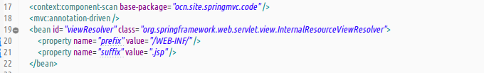
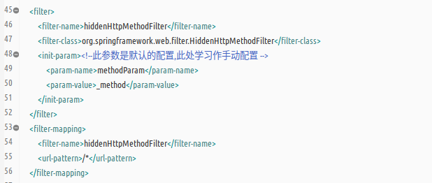
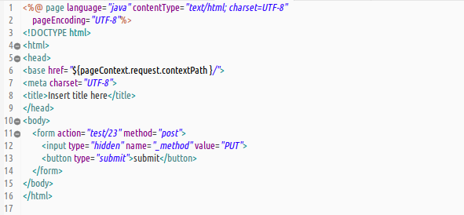
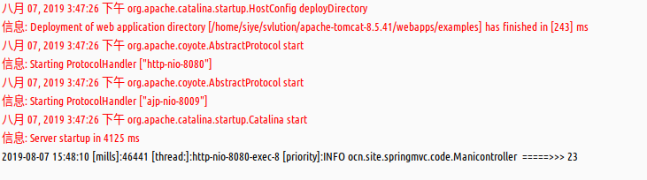

#### 提要  
1. _org.springframework.web.filter.HiddenHttpMethodFilter_ 该过滤器是为了支持`restful`的开发风格.  
1. 作为过滤器一般配置在`web.xml`文件中.  
1. 默认情况下,在post请求的form表单中,需要配置一个隐藏域,该域的`name`值是`_method`,对应的`value`值是`GET`,`POST`,`PUT`或之`DELETE`.  
1. 可手动更改默认配置下的指定参数.  
     
     

#### 使用  
1. 控制器使用  
     
1. _xml-config_ 风格配置  
     
1. _web.xml_ 配置文件(前端控制器,乱码过滤器,禁用jsp脚本略)  
     
1. jsp显示页面  
     
1. 启动服务触发输出结果  
     

#### BUG标记  
1. _HTTP Status 405 - JSPs only permit GET POST or HEAD_  
1. 原因  
   - 发起的是RESTful风格中的PUT请求;  
   - controller控制器中的处理方法,返回的是一个视图,容器会认为这是个jsp接口.  
   - jsp接口仅支持get和post方法,所以会抛出这个错误信息.  
   - 在JSP2.3以后,会出现此问题,tomcat8.5就会报出这种错误.  
1. 解决办法  
   使用注解\@ResponseBody或之\@RestController.  
