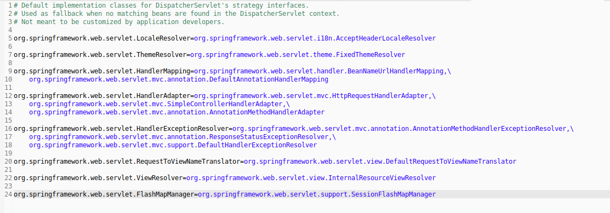
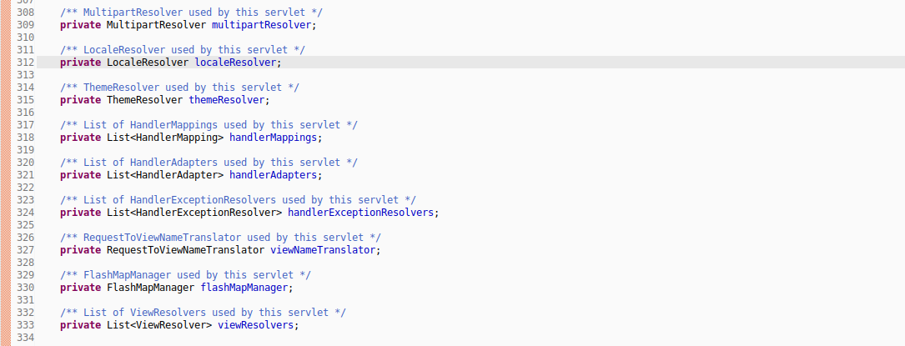
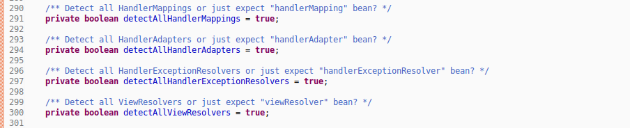

- 当前版本的配置文件概览  
    
- 属性文件解读  
  (1)key指的是spring加载的组件的顶层接口;  
  (2)value指的是,若匹配机制找不到,默认加载的实现类组件;  
- 前端控制器初始化加载组件的实例个数限制  
  (1)查看源码使用集合封装的,表示允许多个实例;  
  (2)没有在属性文件中出现的组件,表示默认情况下不加载;  
  (3)参考属性文件,上传组件`MultipartResolver`不默认初始化加载;  
    
- 组件匹配查找机制  
  (1)默认情况下,以驼峰命名的名称和顶层类型双重匹配机制查询;  
  (2)个别组件设置布尔变量,更改查询机制.若为true,以类型匹配机制查询;若为false,以名称和类型双匹配机制查询;  
    
