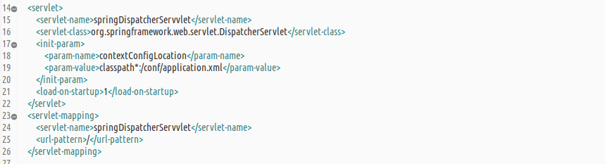
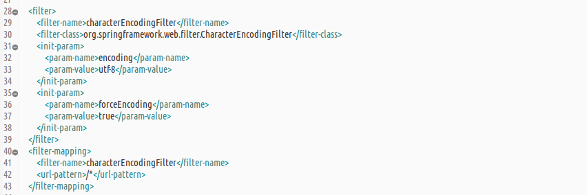
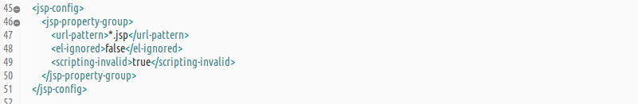
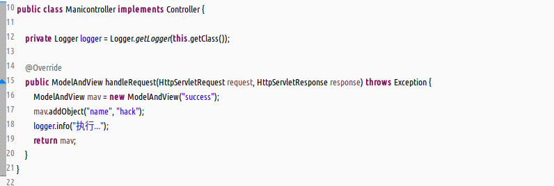
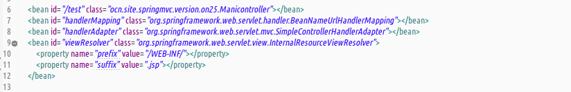
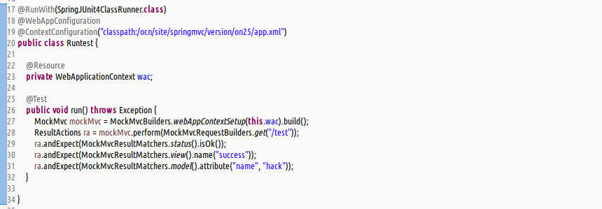
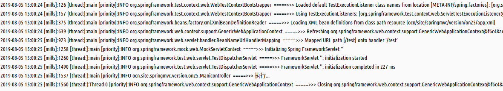

1.基本的配置步骤  
(1)基本配置文件`web.xml`中,配置`DispatcherServlet`,`CharacterEncodingFilter`,以及禁用`jsp`脚本语言支持.  
a.配置`DispatcherServlet`入门方式  
  
b.配置`CharacterEncodingFilter`标准方式  
  
c.禁用`jsp`脚本语言支持  
  
2.控制器中实现`Controller`接口  
  
3.`spring`容器配置文件中手动注册控制器组件,手动配置处理映射器,处理适配器和视图解析器.  
  
4.模拟单元测试  
  
5.测试结果  
  
