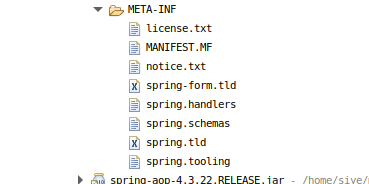
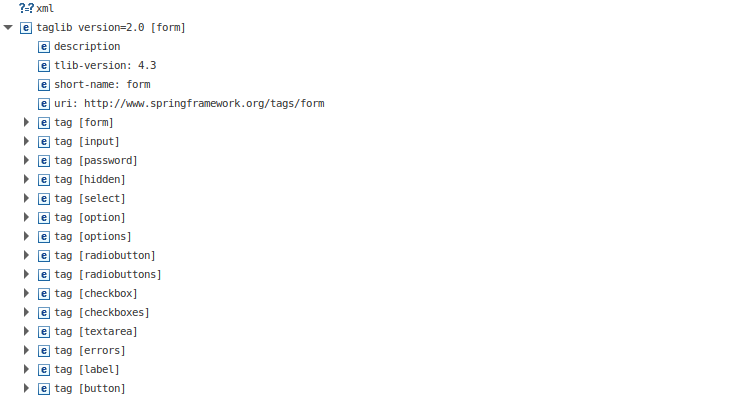
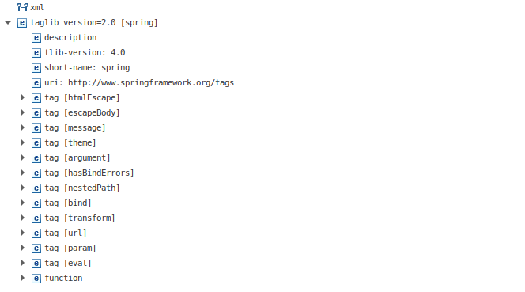
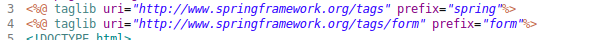
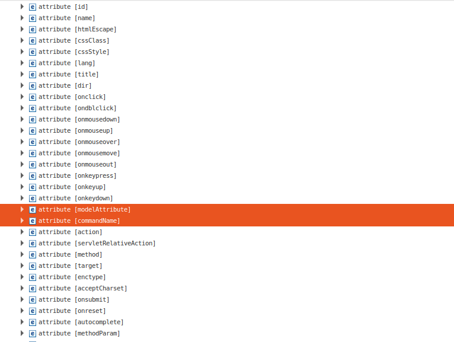
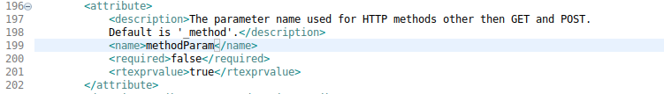
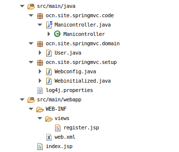
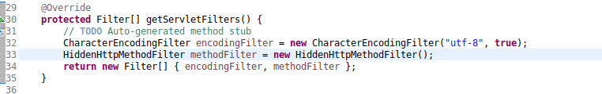
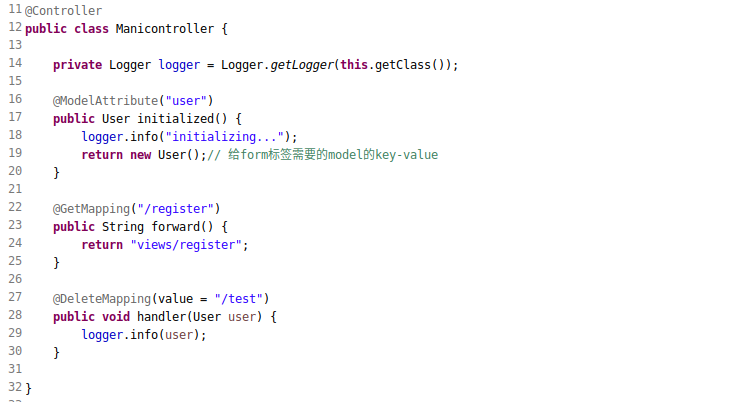
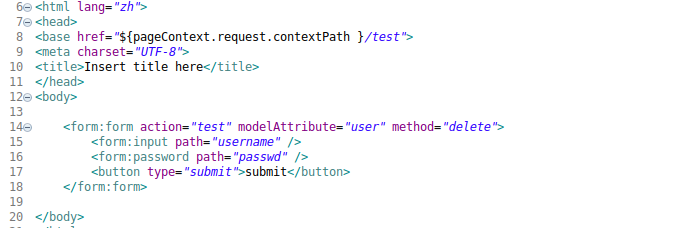

#### 提要  
1. __spring内置标签文件的位置__  
   在`spring-webmvc-4.3.22.RELEASE.jar`资源包中  
     
1. __form标签概览__  
     
1. __spring标签概览__  
     
1. __form\:form标签使用__  
   - _文件引用_  
     
   - _内置属性概览_  
       
   - _form标签注意事项_  
     _1 : Neither BindingResult nor plain target object for bean name 'command' available as request attribute,出现此异常表示指定的key-value(默认key为command)不存在model中._  
     _2 : 重要的属性有`commandName`和`modelAttribute`,通常使用`commandName`其默认值是command,使用form标签model中必须存在匹配的key-value._  
     _3 : form标签的优势是支持除GET和POST之外的方法,普通的html标签是不支持的.使用html标签内置属性`method`设定;与之相关的属性`methodParam`设置http请求过滤相关的配置参数,默认是`_method`._  
       

#### 使用  
1. _容器配置省略查看组织_  
     
     
1. _控制器_  
     
1. _form标签使用_  
     
1. _输出信息省略_  
