#### 提要  
1. 历史  
   - RFC 3986规定了`name-value`可以随着路径片段(path segments)一起出现的规范.  
   - spring3.2中新增注解\@MatrixVariable,支持将url中的矩阵变量绑定到处理器的方法参数上.  
   - 在spring4.0中,全面了支持该注解.  
1. 先决条件  
   - __RFC 3986规定,`name-value`应当绑定url中的路径变量,因此该功能必须和路径变量一同使用.__  
   - 若存在多个路径变量,则使用英文分号`;`分隔.  
   - 若单个矩阵变量包含多个值,可使用英文逗号`,`或之重复的变量名进行约束.  
   - 矩阵变量可存储到 _org.springframework.util.MultiValueMap<K, V>_ 对象中.  
1. _xml-config_ 风格启用禁用矩阵变量支持  
   - 涉及XSD的命名空间为mvc(在 _org.springframework.web.servlet.config_ 包中可查)  
     `<mvc:annotation-driven enable-matrix-variables="false"/>`  
   - 以上的配置,是 _spring4.3.22_ 版本的默认配置方案.具体是否变更,可查看该属性的doc文档说明.  
     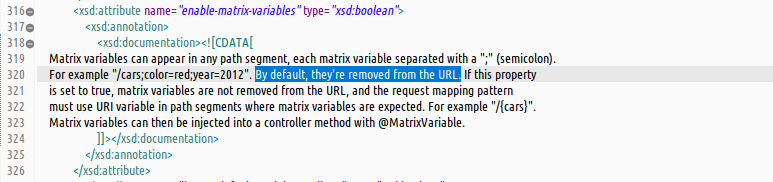  
   - 由文档可知,默认下容器是禁用矩阵变量的,当`enable-matrix-variables`属性设置为true时表示开启.  
1. _java-config_ 风格启用禁用矩阵变量支持  
   - 代码配置标准参考(_开启矩阵变量支持_)  
     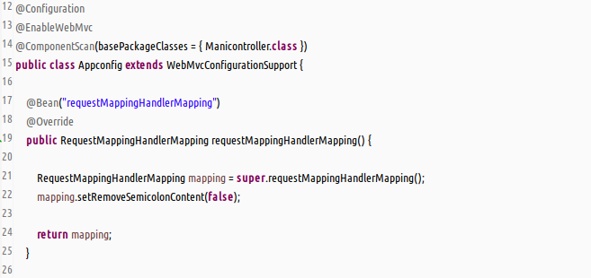  
   - 查看 _WebMvcConfigurationSupport_ 配置类中配置处理映射器的默认方案  
     _由`mapping`引用可知对矩阵变量未配置_  
     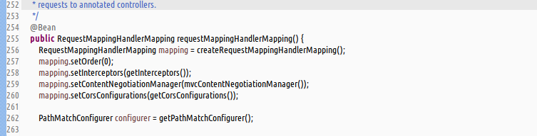  
   - 源码追踪 _java-config_ 的默认配置方案  
     (1)追踪`RequestMappingHandlerMapping`中setter方法的出处  
       
     (2)查看`AbstractHandlerMapping`该方法的源码  
     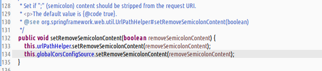  
     (3)选定 _setter_ 方法参数变量`ctrl-alt-h`定位变量的调用  
     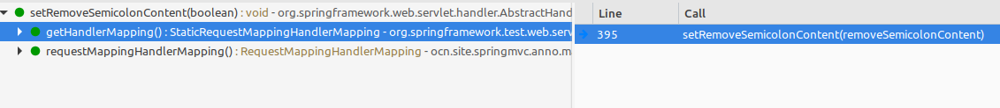  
       
     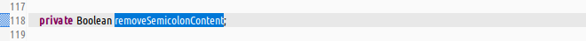  
     _注意使用的是包装类型,默认是null的,故此处追踪未作任何设定_  
     (4)查看 _this.urlPathHelper_ 类中的方法  
     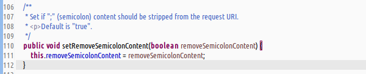  
     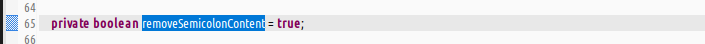  
     (5)查看 _this.globalCorsConfigSource_ 类中的方法  
     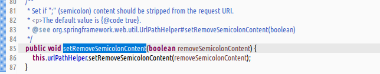  
     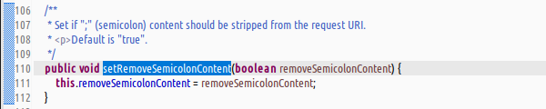  
     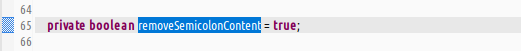  
     (7)总结 : _java-config_ 风格的配置中,默认情况下也是禁用矩阵变量支持的.  
1. 一种常见的异常场景  
   原因:没有开启矩阵变量的支持  
   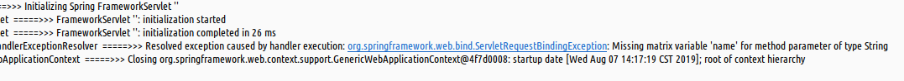  

#### 使用  
1. 控制器使用  
   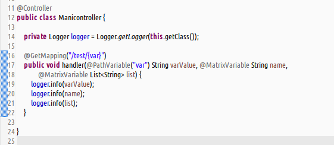  
1. _java-config_ 风格配置  
   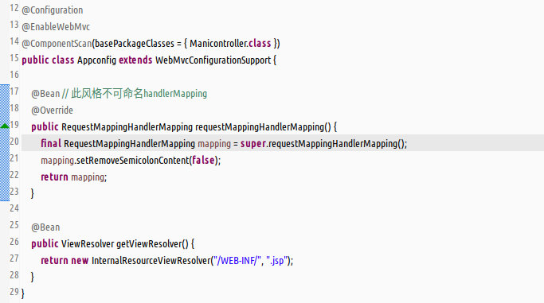  
1. 模拟测试  
   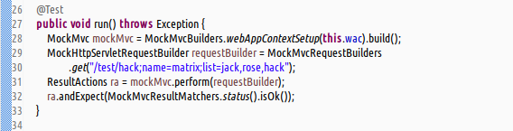  
1. 输出结果  
   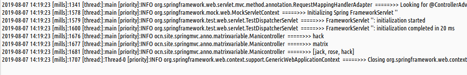  
1. 补充, _java-config_ 配置还有其他选择方案  
   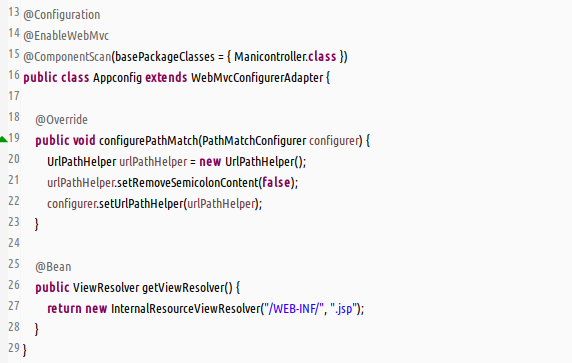  
